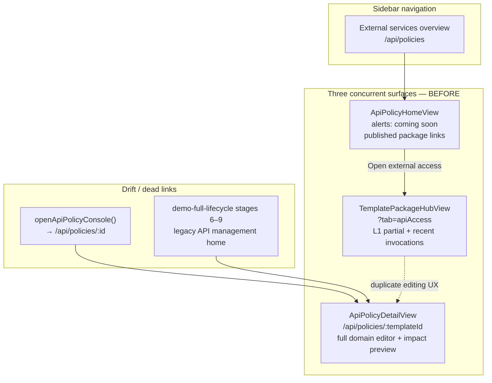
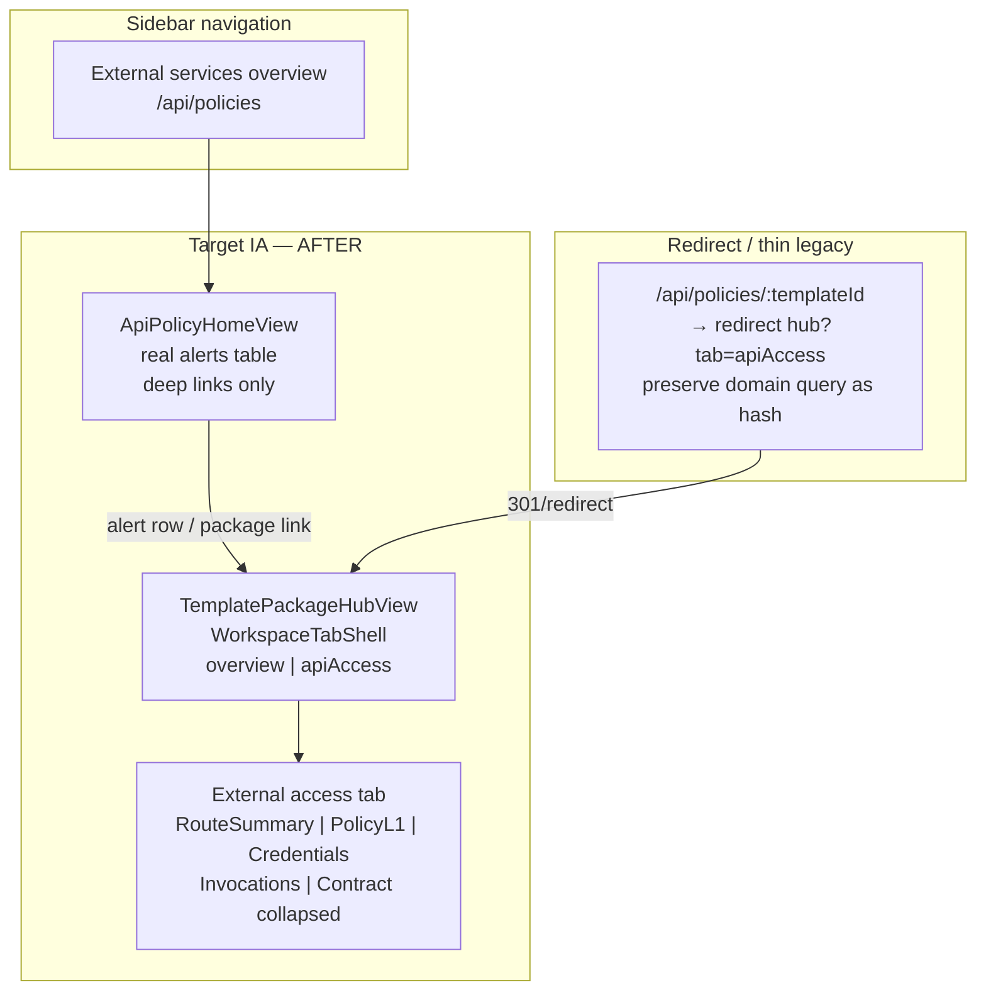
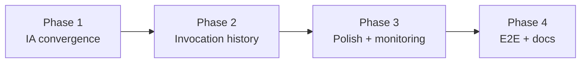

# P13 — External Services Excellence (Detailed Plan)

**Slice ID:** `P13-EXTERNAL-SERVICES-EXCELLENCE`  
**Status:** **Done** (2026-07-08) — Phase 1–4 complete; optional D04/E02 + F06 closed same day  
**Depends on:** [P12-API-PACKAGE-ACCESS-INVOCATION](./P12-api-package-access-invocation-records.md) (**Done** 2026-07-03), P21 (Hub IA), [ADR-0040](../../adr/api-management/0040-api-package-access-and-invocation-retention.md), [catalog-navigation-ux](../../product/catalog-navigation-ux.md) External access tab spec  
**Parent phase:** [P12 deferred enhancements](./P12-deferred-enhancements.md) (catch-all slice registry)  
**BDD base:** Extend [api-package-access-and-invocation-records.md](../../behavior/api-package-access-and-invocation-records.md) + [management-invocation-history.md](../../behavior/management-invocation-history.md) + [api-access-cross-package-alerts.md](../../behavior/api-access-cross-package-alerts.md)

> **Origin:** Gap audit (2026-07-07) against P12 MVP Done state — IA triple-entry drift, management invocation history incomplete, overview alerts placeholder, deferred BDD S1–S3/S7 E2E, CD-E2E-T07/T13 Not Started.

---

## 1. Purpose & North Star

Close the gap between P12 **Done** MVP and **product-intent excellence** for External services / API management.

| Dimension | P12 MVP (Done) | P13 target (excellence) |
| --- | --- | --- |
| **Information architecture** | Hub Tab partial L1 + legacy `ApiPolicyDetailView` still active + overview placeholder | **Single editing surface** — package hub External access tab only; `/api/policies/:id` redirects |
| **Invocation visibility (management)** | Fixed `recent` limit (max 50), no pagination/filters/drill-down | **Full management invocation history** — paginated table, filters, summary drawer, audit deep link |
| **Cross-package monitoring** | `ApiPolicyHomeView` alerts = coming soon | **Real cross-package alerts** on overview (missing AD Group, expiring credentials, zero credentials on published template) |
| **Impact preview UX** | Split between Hub L1 (default route) and legacy detail view (other domains) | **Unified impact-preview UX** for all high-risk domains on Hub tab |
| **OpenAPI surface** | Runtime invocation paths documented; management policy/invocation paths incomplete | **Complete OpenAPI management surface** + codegen regen |
| **Evidence** | P12 Playwright 10/10; S1–S3/S7 deferred; CD-E2E-T07/T13 Not Started | **Full BDD S1–S8 + CD-E2E-T07/T13** browser evidence + UIUX manifest (12+ screenshots) |

**North star sentence:** An administrator configures, monitors, and audits external API access from **one place** (package hub External access tab) and **one overview** (cross-package alerts), with **no duplicate consoles**, **no variable plaintext in management UI**, and **complete E2E evidence** for publish materialization, default-route governance, policy edit-save, and batch logical/flat views.

---

## 2. Locked constraints (do NOT change without new ADR)

These are **confirmed product decisions** from ADR-0040, ADR-0002, BDD C1–C15, and permission-matrix §7. P13 optimizes UX and completeness **within** these boundaries.

| Constraint | Source | P13 implication |
| --- | --- | --- |
| **Package-scoped `api_policy` (NOT per-release policy)** | ADR-0040, ADR-0002 | Route summary may show per-release **paths** (read-only); policy domains remain package-level |
| **Management UI never shows caller variable plaintext** | BDD C6, C15 | Invocation history, drawer, and audit links show **summary only** — no `parametersStorage` in management APIs |
| **15m download TTL, 7d idempotency unchanged** | ADR-0004, ADR-0005 | Do not extend or shorten platform clocks in this slice |
| **Primary config surface = package hub External access tab** | ADR-0040, catalog-navigation-ux | All edit flows land on `?tab=apiAccess`; legacy detail view removed or redirect-only |
| **Overview = cross-package monitoring only (not second catalog)** | BDD §5.3, P12-T08 | `ApiPolicyHomeView` shows alerts + deep links; no template catalog duplicate |
| **Four-layer retention clock** | ADR-0040 | L0 download 15m / L1 idempotency 7d / L2 doc TTL / L3 record TTL — separate schedulers |
| **Auto-materialize on publish** | BDD S1, C10 | First publish sets default route; subsequent publish does not silently change default |
| **Fail-closed authorization** | permission-matrix §7 | Group scope + `canManageApiPolicy`; cross-credential invocation access → 403 |

---

## 3. Current vs Target IA

### 3.1 Problem — triple entry (BEFORE)

P12 declared Hub Tab as primary surface but left **three concurrent entry points** for API configuration and monitoring:



| Surface | Route | Role today | Gap |
| --- | --- | --- | --- |
| `ApiPolicyHomeView` | `/api/policies` | Cross-package overview | Alerts placeholder; not real monitoring |
| `ApiPolicyDetailView` | `/api/policies/:templateId` | Legacy full console | **Still active** — duplicates Hub; impact preview for non-default domains |
| Hub External access tab | `/templates/:templateId?tab=apiAccess` | Primary L1 (P12 intent) | Missing route summary card, full invocation history, unified preview |

### 3.2 Target — single edit surface (AFTER)



| Surface | Route | Target role |
| --- | --- | --- |
| `ApiPolicyHomeView` | `/api/policies` | Cross-package **alerts + deep links** only |
| Hub External access tab | `/templates/:templateId?tab=apiAccess` | **Sole editing surface** — L1 + history + unified preview |
| Legacy detail | `/api/policies/:templateId` | **Redirect** to hub tab; optional thin shim preserving `domain` anchor |

### 3.3 Hub External access tab — target layout (single scroll)

| Region | Component (target) | L1 copy keys (en / zh-CN namespace) |
| --- | --- | --- |
| Route summary | `RouteSummaryPanel` | `templates.policy.l1` + route path labels; tab title `templates.policy.title` (**External access** / **对外接入**) |
| Policy L1 | `PolicyL1Card` | `templates.policy.l1.adGroupsTitle`, `defaultRouteTitle`, `templates.policy.retention.*` |
| Credentials | `CredentialsCard` | `templates.policy.credentialsTitle`, `createCredential`, credential column keys |
| Invocations | `TemplateInvocationsPanel` | `templates.policy.recentInvocations.*` → extended to full history |
| Contract | `TemplateCallerContractPanel` | `templates.contract.title` (**Caller contract** / **调用方契约**); **collapsed by default** |

---

## 4. Task breakdown (28 tasks in 6 groups)

### Group A — IA convergence (6 tasks)

| ID | Owner | Task | Status | Key files |
| --- | --- | --- | --- | --- |
| **P13-ESO-A01** | behavior-spec-author | Confirm IA + redirect behavior BDD — document redirect semantics, domain hash preservation, deprecated detail view; acceptance scenarios for deep link and bookmark migration | **Done** (2026-07-08) | `docs/behavior/api-package-access-and-invocation-records.md` (extend §15 IA) |
| **P13-ESO-A02** | frontend-engineer | Router redirect `/api/policies/:templateId` → `templatePackageHubPath(id, 'apiAccess')` preserving `domain` query as hash/anchor | **Done** (2026-07-08) | `frontend/src/router/index.ts`, `routeKeys.ts`, `frontend/nginx.conf` (SPA exception for `/api/policies`) |
| **P13-ESO-A03** | frontend-engineer | Deprecate `ApiPolicyDetailView` — extract shared impact preview into hub tab; delete or thin redirect component | **Done** (2026-07-08) | `ApiPolicyDetailView.vue` deleted; `apiPolicyHubPath` canonical; `apiPolicyDetailPath` deprecated |
| **P13-ESO-A04** | frontend-engineer | Remove dead `openApiPolicyConsole` / `openConsole` links; fix `demo-full-lifecycle` stages 6–9 to use Hub + External services overview nav SSOT | **Done** (2026-07-08) | `useTemplatePolicyCredentials.ts`, `demo-full-lifecycle.spec.ts` |
| **P13-ESO-A05** | frontend-engineer | `TemplatePackageHubView` secondary tabs → `WorkspaceTabShell` (`overview` \| `apiAccess`) | **Done** (2026-07-08) | `TemplatePackageHubView.vue` |
| **P13-ESO-A06** | frontend-engineer | `TemplateDetailApiAccessTab` re-layout — single scroll regions: `RouteSummaryCard` \| `PolicyL1Card` \| `CredentialsCard` \| `InvocationsCard` \| `ContractCard` (collapsed by default) | **Done** (2026-07-08) | `TemplateDetailApiAccessTab.vue` |

**Group A exit:** **Done** (2026-07-08) — no active duplicate editor; redirect verified; demo-full-lifecycle stages 6–9 aligned to new IA. **Gate:** `pnpm -C frontend lint` ✓, `type-check` ✓, `test` ✓ (**807**/807), `build` ✓.

---

### Group B — Route summary & version-aware display (4 tasks) — NOT per-release policy

| ID | Owner | Task | Status | Key files |
| --- | --- | --- | --- | --- |
| **P13-ESO-B01** | frontend-engineer | `RouteSummaryPanel` — package `externalId`, default path URL, current default release badge | **Done** (2026-07-08) | `RouteSummaryPanel.vue` |
| **P13-ESO-B02** | frontend-engineer | Extend version-lines table OR hub subsection with explicit generate path per published release (read-only) | **Done** (2026-07-08) | Explicit paths table in `RouteSummaryPanel.vue` |
| **P13-ESO-B03** | backend-engineer | Optional `GET …/api/routes-summary` returning assembled paths from `ContractAssemblyService` (reuse, **no new policy model**) | **Done** (2026-07-08) | `ApiManagementController.java`, `ApiRoutesSummaryView.java` |
| **P13-ESO-B04** | e2e-test-engineer | Assert route summary visible on hub External access without opening contract panel | **Done** (2026-07-08) | `frontend/e2e/P13-EXTERNAL-SERVICES.spec.ts` |

**Group B constraint reminder:** Per-release rows show **callable paths only**; `api_policy` remains one row per template package.

---

### Group C — Management invocation history (8 tasks)

| ID | Owner | Task | Status | Key files |
| --- | --- | --- | --- | --- |
| **P13-ESO-C01** | behavior-spec-author | Author `management-invocation-history.md` — pagination, filters, summary detail, **no parameters** | **Done** (2026-07-08) | `docs/behavior/management-invocation-history.md` |
| **P13-ESO-C02** | backend-engineer | TDD: `GET …/api/invocations` with `page`/`size`/`total` (replace or extend `recent`) | **Done** (2026-07-08) | `ApiManagementController.java`, `ManagementInvocationQueryService.java` |
| **P13-ESO-C03** | backend-engineer | Filters: `status`, `invocationKind`, `requestId`, date range (`createdAfter`/`createdBefore`), `credentialId` | **Done** (2026-07-08) | `ManagementInvocationFilters.java` |
| **P13-ESO-C04** | backend-engineer | `GET …/api/invocations/{invocationId}` → `ManagementInvocationDetailView` (summary only) | **Done** (2026-07-08) | `ManagementInvocationDetailView.java` |
| **P13-ESO-C05** | backend-engineer | Flyway index on `api_invocation_record (template_id, created_at DESC)` | **Done** (2026-07-08) | `V48__api_invocation_record_template_created_index.sql` |
| **P13-ESO-C06** | frontend-engineer | `TemplateInvocationsPanel` with `AppDataTable` + `AppTablePagination` + filters | **Done** (2026-07-08) | `TemplateInvocationsPanel.vue` |
| **P13-ESO-C07** | frontend-engineer | `InvocationSummaryDrawer` — drill-down, link to audit console filtered by `requestId` | **Done** (2026-07-08) | `InvocationSummaryDrawer.vue`, audit `requestId` filter |
| **P13-ESO-C08** | doc-keeper | OpenAPI management invocation paths + codegen regen | **Done** (2026-07-08) | `docs/api/openapi-v1.yaml`, `contract-outline.md`, `codegen:openapi` |

#### C01 — BDD acceptance scenarios (inline draft for behavior-spec-author)

**BDD ID:** `BDD-MGMT-INVOCATION-HISTORY-001`  
**Actor:** `GROUP_ADMIN` / `GLOBAL_ADMIN` with `canManageApiPolicy` on template's group.

**SCEN-HIST-01 — Paginated list (required)**

- **Given** a published template with ≥ 25 invocation records in retention window  
- **When** the administrator opens External access tab and scrolls to Invocations  
- **Then** the panel loads page 1 with `size` default (e.g. 20) and displays `totalElements`; pagination controls advance to page 2 without loading variable plaintext

**SCEN-HIST-02 — Filter by status and kind (required)**

- **Given** invocations with mixed `outcome` and `invocationKind` values  
- **When** the administrator filters `status=FAILED` and `invocationKind=SINGLE`  
- **Then** only matching summary rows appear; API query params mirror UI filters

**SCEN-HIST-03 — Summary drawer, no parameters (required — C6)**

- **Given** a successful invocation with stored caller parameters  
- **When** the administrator opens invocation summary for that row  
- **Then** the drawer shows `invocationId`, `requestId`, route summary, `accessAccount` (masked if policy requires), timing, outcome; **And** no `variables` / `parametersStorage` field is present in management response or UI

**SCEN-HIST-04 — Audit deep link (required)**

- **Given** an invocation with known `requestId`  
- **When** the administrator clicks «View in audit console» (or equivalent L1 key)  
- **Then** navigation opens audit console with `requestId` filter pre-applied

**SCEN-HIST-05 — Empty and expired (boundary)**

- **Given** a template with zero invocations  
- **When** the panel loads  
- **Then** empty state uses `templates.policy.recentInvocations.emptyTitle` / `emptyDescription` keys (en: «No recent invocations» / zh: **暂无最近调用**)

**L1 copy keys (management invocation — proposed, en base first):**

| Surface | en (base) | zh-CN (additive) | Key |
| --- | --- | --- | --- |
| Panel title | Invocation history | 调用历史 | `templates.policy.invocations.title` |
| Filter status | Status | 状态 | `templates.policy.invocations.filters.status` |
| Filter kind | Kind | 类型 | `templates.policy.invocations.filters.kind` |
| Filter date range | Date range | 日期范围 | `templates.policy.invocations.filters.dateRange` |
| Drawer title | Invocation summary | 调用摘要 | `templates.policy.invocations.drawer.title` |
| Audit link | View in audit console | 在审计控制台中查看 | `templates.policy.invocations.drawer.auditLink` |

---

### Group D — Cross-package monitoring (5 tasks)

| ID | Owner | Task | Status | Key files |
| --- | --- | --- | --- | --- |
| **P13-ESO-D01** | behavior-spec-author | Author `api-access-cross-package-alerts.md` | **Done** (2026-07-08) | `docs/behavior/api-access-cross-package-alerts.md` |
| **P13-ESO-D02** | backend-engineer | `GET /api/management/v1/api-access/alerts` — missing AD Group, credentials expiring within 30d, zero credentials on published template | **Done** (2026-07-08) | `ApiAccessController.java`, `ApiAccessAlertQueryService.java` |
| **P13-ESO-D03** | frontend-engineer | `ApiPolicyHomeView` alerts table replacing coming soon | **Done** (2026-07-08) | `ApiPolicyHomeView.vue` |
| **P13-ESO-D04** | frontend-engineer | Dashboard quick-link integration (optional — link from dashboard widget to filtered overview) | **Done** (2026-07-08) | `useDashboardStats.ts`, `useDashboardDataLoader.ts`, `DashboardStatCards.vue` |
| **P13-ESO-D05** | e2e-test-engineer | Overview shows real alert for seeded fixture | **Done** (2026-07-08) | `P13-EXTERNAL-SERVICES.spec.ts` |

#### D01 — BDD acceptance scenarios (inline draft for behavior-spec-author)

**BDD ID:** `BDD-API-ACCESS-CROSS-PACKAGE-ALERTS-001`  
**Actor:** `GROUP_ADMIN` / `GLOBAL_ADMIN` with API policy management scope.

**SCEN-ALERT-01 — Missing AD Group on published template (required)**

- **Given** a published template whose `api_policy.allowedAdGroups` is empty  
- **When** the administrator opens External services overview (`/api/policies`)  
- **Then** an alert row appears with severity warning, template name, external ID, and deep link to hub `?tab=apiAccess`; L1 uses `apiPolicy.home.alerts.missingAdGroup` (proposed)

**SCEN-ALERT-02 — Credential expiring within 30 days (required)**

- **Given** a published template with an access key in `EXPIRING_SOON` status (≤ 30 days)  
- **When** the overview loads alerts  
- **Then** an alert row lists credential external ID, expiry date, and deep link to hub credentials section

**SCEN-ALERT-03 — Zero credentials on published callable template (required)**

- **Given** a published template with valid routes but zero non-revoked credentials  
- **When** the overview loads  
- **Then** an alert row recommends creating an access key with link to hub External access tab

**SCEN-ALERT-04 — No false catalog (boundary)**

- **Given** 50+ published templates in scope  
- **When** the administrator opens overview  
- **Then** the page shows **alerts table + deep links only**; it does **not** render a full paginated template catalog (BDD R18 / ADR-0040)

**SCEN-ALERT-05 — Group scope fail-closed (boundary)**

- **Given** a `GROUP_ADMIN` authorized only for group `RETAIL`  
- **When** alerts are fetched  
- **Then** alerts for templates outside `RETAIL` are excluded; no cross-group leakage

**L1 copy keys (overview alerts — proposed):**

| Surface | en (base) | zh-CN (additive) | Key |
| --- | --- | --- | --- |
| Overview title | External services overview | 对外服务概览 | `apiPolicy.home.title` |
| Monitoring hint | Monitor cross-package external access… | （现有 `apiPolicy.home.monitoringHint`） | `apiPolicy.home.monitoringHint` |
| Alerts section | Attention needed | 需要关注 | `apiPolicy.home.alerts.title` |
| Missing AD Group | Missing authorized AD group | 缺少授权 AD 组 | `apiPolicy.home.alerts.missingAdGroup` |
| Expiring credential | Access key expiring soon | 访问密钥即将过期 | `apiPolicy.home.alerts.expiringCredential` |
| No credentials | No access keys configured | 未配置访问密钥 | `apiPolicy.home.alerts.noCredentials` |
| Open package | Open external access | 打开对外接入 | `apiPolicy.home.publishedPackages.openAccess` |

---

### Group E — Unified policy editing UX (3 tasks)

| ID | Owner | Task | Status | Key files |
| --- | --- | --- | --- | --- |
| **P13-ESO-E01** | frontend-engineer | Hub tab uses `ApiPolicyImpactPreviewPanel` for **ALL** high-risk domains (default route, output policy, batch limits) — same UX as former detail view | **Done** (2026-07-08) | `ApiPolicyDomainEditor.vue` |
| **P13-ESO-E02** | frontend-engineer | Retention domain save inline with preset validation feedback | **Done** (2026-07-08) | `ApiPolicyDomainEditor.vue` retention subsection |
| **P13-ESO-E03** | e2e-test-engineer | **CD-E2E-T07:** `CDP-E2E-T07-api-policy-edit-save.spec.ts` + UIUX manifest | **Done** (2026-07-08) | Docker E2E green |

---

### Group F — E2E completeness & docs (6 tasks)

| ID | Owner | Task | Status | Key files |
| --- | --- | --- | --- | --- |
| **P13-ESO-F01** | e2e-test-engineer | **CD-E2E-T13:** S1 first publish materialize + dual paths | **Done** (2026-07-08) | `CDP-E2E-T13-api-package-materialize.spec.ts` |
| **P13-ESO-F02** | e2e-test-engineer | **CD-E2E-T13:** S2 second publish default unchanged | **Done** (2026-07-08) | Same spec |
| **P13-ESO-F03** | e2e-test-engineer | **CD-E2E-T13:** S3 explicit default change with impact preview | **Done** (2026-07-08) | Same spec |
| **P13-ESO-F04** | e2e-test-engineer | S7 batch logical vs flat (runtime API) | **Done** (2026-07-08) | `P12-API-PACKAGE-ACCESS-RUNTIME.spec.ts` |
| **P13-ESO-F05** | e2e-uiux-reviewer | UIUX manifest 12+ screenshots — hub L1, overview alerts, invocation list/drawer, REDBC + GREENBC | **Done** (2026-07-08) | 7 screenshots; manifest PASS (drawer added) |
| **P13-ESO-F06** | post-task-doc-sync | Ledger, README index, taskmaster entry | **Done** (2026-07-08) | `execution-sync-ledger.md`, this plan |

---

## 5. Implementation phases

| Phase | Week | Tasks | Status / Outcome |
| --- | --- | --- | --- |
| **Phase 1** | Week 1 | A01–A06, E03 partial | **Done** (2026-07-08) — IA truth + E2E drift fix; redirect live; demo-full-lifecycle stages 6–9 aligned. **Gate:** `pnpm -C frontend lint` ✓, `type-check` ✓, `test` ✓ (**807**/807), `build` ✓ |
| **Phase 2** | Week 2 | C01–C08 | **Done** (2026-07-08) — invocation history full stack + OpenAPI |
| **Phase 3** | Week 3 | B + D + E (partial) | **Done** (2026-07-08) — routes summary, alerts, impact preview |
| **Phase 4** | Week 4 | F01–F06 | **Done** (2026-07-08) — CD-E2E-T13, S7, UIUX manifest + drawer; D04/E02/F06 closed |



**Critical path:** A01 → A02 → A03 (redirect before deleting detail) → C02 → C06 → F01–F04.

**Parallel OK:** B03 backend routes-summary while C02 invocation pagination proceeds; D02 alerts API parallel to C-group after C01 spec ready.

---

## 6. Perfect finish criteria (checklist)

Derived from gap audit §7 (2026-07-07). All items required before slice **Done**.

### Product / UX

- [ ] **Single edit surface:** configuration edits occur only on hub `?tab=apiAccess`; `/api/policies/:templateId` redirects (301 or router redirect) to hub tab
- [ ] **BDD S1–S8** each evidenced by Playwright and/or API + E2E (including **S7** batch flat view)
- [ ] **CD-E2E-T07** manifest **PASS** — edit → impact preview → save → `policyVersion` increment + audit entry visible
- [ ] **Management invocation:** paginated list + ≥ 3 filters (status, kind, date range minimum) + summary drawer; **no** `parameters` / variable plaintext field in management API or UI
- [ ] **Overview alerts:** ≥ 1 real alert type rendered from backend (not «coming soon» placeholder)
- [ ] **L1 complete on hub tab:** AD Group, default route, retention presets, route summary, credentials, invocation history section

### Contract / governance

- [ ] **OpenAPI** documents management invocation list/detail + policy paths (+ alerts if exposed as REST)
- [ ] **permission-matrix §7** wording matches implemented management invocation + alert scope
- [ ] **ADR-0040** non-decision items unchanged (no per-release policy, no TTL changes)

### Quality gates

- [ ] Backend `mvn -B -ntp -f backend/pom.xml verify` BUILD SUCCESS
- [ ] Frontend `pnpm -C frontend lint && type-check && test && build` green
- [ ] Docker deploy + Playwright docker suite green for P13 specs
- [ ] UIUX manifest **PASS** (hub + overview + invocation list/drawer; REDBC + GREENBC)
- [ ] `docs/plan/execution-sync-ledger.md` records gate evidence and Playwright counts
- [ ] No `test.skip` without manifest entry and documented reason (CDP anti-pattern)

### IA consistency

- [ ] No unused `openConsole` / `openApiPolicyConsole` dead links in production paths
- [ ] `demo-full-lifecycle` and P12 specs use same nav label SSOT (`nav.items.apiPolicies` → **External services overview**)
- [ ] Hub secondary tabs use `WorkspaceTabShell` OR documented exception in catalog-navigation-ux with plan-orchestrator approval

---

## 7. Non-goals

Per P12 slice close-out, ADR-0040, and BDD confirmed decisions — **this slice must NOT introduce:**

| Non-goal | Rationale |
| --- | --- |
| Per-release API policy overrides | v1 remains package-scoped (ADR-0002, ADR-0040) |
| Cross-template global runtime invocation list | Deferred v2 (P12 non-goals) |
| Changing 15-minute download URL TTL | ADR-0005 locked |
| Changing 7-day idempotency window | ADR-0004 locked |
| Replacing compliance audit console with invocation records | Separate concerns (C6/C15) |
| Management UI showing caller **full** variables plaintext | BDD C6 hard constraint |
| Standalone API catalog as second template list | Overview = monitoring only |
| New `API_ADMIN` role or permission matrix expansion | Out of scope unless user confirms |
| Credential lifecycle redesign (rotation UX overhaul) | Existing P6/P7 scope sufficient for P13 |
| Runtime API contract changes beyond documented management additions | Minimize caller impact |

---

## 8. Risks

| Risk | Impact | Mitigation | Owner phase |
| --- | --- | --- | --- |
| Deprecating `ApiPolicyDetailView` while Hub still incomplete | User confusion; broken bookmarks; E2E fragmentation | Phase A: redirect first, then thin/delete; A01 BDD documents migration | Phase 1 |
| High-volume invocation queries on busy templates | Slow pagination; DB load | C05 index `(template_id, created_at DESC)`; default page size 20; retention TTL bounds query window | Phase 2 |
| Unified impact preview increases Hub tab complexity | Conflicts with «convention over configuration» L1 | E01: preview required only for high-risk domains (default route, output policy, batch limits); retention uses lighter confirm | Phase 3 |
| `demo-full-lifecycle` vs P12/CDP specs use different nav labels | CI red; false failures | A04 + F06: unify nav SSOT (`navStructure.ts` / i18n); update all affected specs in same PR | Phase 1 / 4 |
| OpenAPI management paths lag contract-outline | Integration drift; codegen stale | C08 in same change set as backend endpoints; doc-keeper gate | Phase 2 |
| `TemplateDetailView` still hosts `apiAccess` slot on dev editor | Duplicate tab during migration | Document dev-editor exception OR deep-link to hub only; A06 ensures hub is canonical | Phase 1 |
| Seeded alert fixtures insufficient for D05 E2E | Flaky overview tests | Coordinate with demo seeder; idempotent fixture for missing AD Group template | Phase 3 |
| Large UIUX manifest scope (12+ screenshots) | Review bottleneck | F05 staged by viewport/brand; reuse P12 manifest patterns | Phase 4 |

---

## 9. Traceability matrix

### 9.1 Tasks → BDD scenarios (P12 base)

| BDD scenario | Description | Primary tasks |
| --- | --- | --- |
| **S1** | First publish materialize dual API | F01, B01–B03 |
| **S2** | Second publish default unchanged | F02 |
| **S3** | Explicit default change + impact preview | F03, E01, A03 |
| **S4** | Convention L1 + advanced collapsed | A06, E01, F05 |
| **S5** | Invocation write + caller query | F04 (runtime); C-group (management mirror) |
| **S6** | Record vs audit separation | C04, C07 (no parameters in management) |
| **S7** | Logical vs flat batch views | F04 |
| **S8** | Retention preset save | E02, C08 |

### 9.2 Tasks → CDP E2E

| CDP task | BDD source | Primary tasks |
| --- | --- | --- |
| **CD-E2E-T07** | [api-policy-edit-save-journey.md](../../behavior/api-policy-edit-save-journey.md) | E03, E01, A03 |
| **CD-E2E-T13** | P12 S1–S3 deferred | F01, F02, F03 |

### 9.3 Tasks → catalog-navigation-ux

| catalog-navigation-ux requirement | Tasks |
| --- | --- |
| External access tab L1 (routes, AD Group, default, retention, credentials) | A06, B01–B02, E02 |
| Version lines default-route indicator + explicit path | B02 |
| Overview = cross-package monitoring, not catalog | D01–D03 |
| Hub secondary tabs (overview \| apiAccess) | A05 |
| No «API not configured» empty state after skeleton | A06 (verify retained from P12) |

### 9.4 Tasks → ADR-0040 decisions

| ADR-0040 decision | Tasks |
| --- | --- |
| Package-first configuration surface | A01–A06 |
| Auto-materialize + no silent default change | F01–F03 |
| Four-layer retention clock | E02 (no clock change) |
| Management summary without variable plaintext | C01, C04, C06, C07 |
| Standalone catalog demoted to monitoring | D01–D03, A02 |
| OpenAPI invocation paths | C08 |

### 9.5 Gap audit → task mapping

| Gap ID (audit) | Priority | Tasks |
| --- | --- | --- |
| G-P0-01 Dual edit surfaces | P0 | A02, A03, A04 |
| G-P0-02 E2E IA drift | P0 | A04, F01–F03 |
| G-P0-03 Management history incomplete | P0 | C02–C07 |
| G-P0-04 OpenAPI management incomplete | P0 | C08 |
| G-P0-05 BDD S1–S3/S7 E2E deferred | P0 | F01–F04 |
| G-P0-06 CD-E2E-T07 Not Started | P0 | E03 |
| G-P1-01 Route summary incomplete | P1 | B01–B04 |
| G-P1-02 Hub impact preview inconsistent | P1 | E01 |
| G-P1-03 Overview placeholder | P1 | D02–D03 |
| G-P1-04 Hub not WorkspaceTabShell | P1 | A05 |
| G-P1-05 Legacy route not redirected | P1 | A02 |
| G-P1-06 TemplateDetailView duplicate tab | P1 | A06 (hub canonical) |

---

## 10. Key file index

| Area | Path |
| --- | --- |
| Hub shell | `frontend/src/views/templates/TemplatePackageHubView.vue` |
| External access tab | `frontend/src/views/templates/detail/TemplateDetailApiAccessTab.vue` |
| Legacy detail (deprecate) | `frontend/src/views/api/ApiPolicyDetailView.vue` |
| Overview | `frontend/src/views/api/ApiPolicyHomeView.vue` |
| Recent invocations (extend) | `frontend/src/components/templates/TemplateRecentInvocationsPanel.vue` |
| Domain editor | `frontend/src/components/api/ApiPolicyDomainEditor.vue` |
| Impact preview | `frontend/src/components/api/ApiPolicyImpactPreviewPanel.vue` |
| Contract panel | `frontend/src/components/templates/TemplateCallerContractPanel.vue` |
| Navigation SSOT | `frontend/src/navigation/navStructure.ts` |
| Router | `frontend/src/router/index.ts` |
| Management controller | `backend/src/main/java/com/bank/docgen/apimgmt/web/ApiManagementController.java` |
| Management invocation query | `backend/src/main/java/com/bank/docgen/apimgmt/service/ManagementInvocationQueryService.java` |
| Runtime invocation query | `backend/src/main/java/com/bank/docgen/runtime/service/InvocationQueryService.java` |
| Invocation write path | `backend/src/main/java/com/bank/docgen/runtime/service/InvocationRecordService.java` |
| P12 plan (predecessor) | [P12-api-package-access-invocation-records.md](./P12-api-package-access-invocation-records.md) |
| BDD base | [api-package-access-and-invocation-records.md](../../behavior/api-package-access-and-invocation-records.md) |
| CDP E2E program | [CDP-e2e-full-chain-evidence.md](./CDP-e2e-full-chain-evidence.md) |
| ADR | [0040-api-package-access-and-invocation-retention.md](../../adr/api-management/0040-api-package-access-and-invocation-retention.md) |
| Terminology | [business-terminology-guide.md](../../product/business-terminology-guide.md) § External access |

---

## 11. Suggested implementation order (within phases)

1. **A01** behavior spec (IA redirect + history + alerts outlines)  
2. **A02 → A03 → A04** redirect + deprecate detail + fix dead links  
3. **A05 → A06** WorkspaceTabShell + tab re-layout  
4. **C01** then **C02 → C05 → C03 → C04** (TDD backend history)  
5. **C06 → C07** frontend history panel + drawer  
6. **C08** OpenAPI sync  
7. **D01 → D02 → D03 → D05** alerts stack  
8. **B01 → B03 → B02 → B04** route summary  
9. **E01 → E02 → E03** unified preview + CD-E2E-T07  
10. **F01 → F04 → F05 → F06** remaining E2E + doc sync  

---

## 12. Gate commands (slice exit)

```powershell
# Backend full gate
mvn -B -ntp -f backend/pom.xml verify

# Frontend full gate
pnpm -C frontend lint && pnpm -C frontend type-check && pnpm -C frontend test && pnpm -C frontend build

# Docker deploy + E2E (from repo root)
.\scripts\docker-deploy.ps1
pnpm -C frontend test:e2e:docker -- <P13-spec-glob>

# UIUX evidence (e2e-uiux-reviewer)
pnpm -C frontend exec playwright test --config=frontend/playwright.docker.config.ts frontend/e2e/evidence/P13-EXTERNAL-SERVICES-uiux-evidence.spec.ts
```

---

## 13. Related documents

- [P12 deferred enhancements](./P12-deferred-enhancements.md) — parent slice registry  
- [P12 API package access (Done)](./P12-api-package-access-invocation-records.md)  
- [Competitiveness deepening program](../competitiveness-deepening-program.md) — CD-E2E-T07/T13  
- [P17 API policy domain governance](./P17-api-policy-domain-governance.md) — default-route impact preview reuse  
- [Permission matrix §7](../../security/permission-matrix.md) — API management scope  

---

## 14. Pending questions

| ID | Question | Blocking? |
| --- | --- | --- |
| PQ-01 | Should `TemplateDetailView` dev editor **remove** apiAccess tab entirely or keep read-only deep link to hub? | No — A01 can confirm; default = hub canonical |
| PQ-02 | Dashboard alert widget (D04) in scope for Phase 3 or defer? | No — marked optional |
| PQ-03 | Default management invocation page size (20 vs 50)? | No — propose 20 in C01 |

None blocking slice activation via `plan-orchestrator`.
