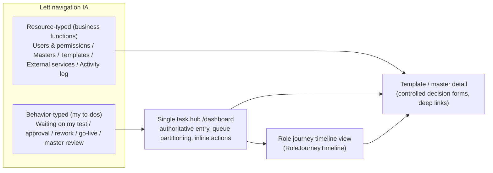

# P21 — Role-Journey Frontend Redesign & Business-Friendly Terminology (Detailed Plan)

**Phase status:** Not Started (registered 2026-06-29) | **Depends on:** P13, P14, P19, P20 (management shell, dashboard task hub, collaboration work items, i18n registry)
**Confirmed (user, 2 rounds, 2026-06-29):** Hybrid architecture (B) + 4 role clusters by workflow timeline + primary persona = foreign-bank front/middle-office non-IT staff with business-friendly terminology.

> Single-active-phase invariant: there is currently **No active formal phase**. Activating P21
> requires `plan-orchestrator` selection. Within P21, run sub-phases in order A → B → C → D, and
> within each sub-phase land the **backend collaboration-work-item contract** before the
> behavior-driven IA, otherwise behavior queues are empty shells.

## 1. Why (problem statement)

Verified by read-only exploration (frontend + workflow contract + plan layer):

- The single `/dashboard` task hub is a **read-only table + jump**: no queue partitioning, no
  inline actions, and it drops mapped fields `triggerType / summaryText / ageSeconds`.
- Left navigation is **resource-typed** (users / masters / templates / policies / audit) with
  **no behavior-typed entries** ("waiting on my test / approval / publish / rework"), decoupled
  from each role's behavior timeline.
- `frontend/src/views/home/RoleHomeView.vue` is orphaned dead code; `routeKeys.ts` /
  `auth/roles.ts` retain workbench logical keys after the views were deleted.
- Backend `CollaborationWorkItemWriter` **emits only `SUBMIT_FOR_TEST` and never writes
  `RESOLVED`** — behavior queues other than TEST are effectively empty.
- **IT-heavy labels** (e.g. "API policy", "credential", "lifecycle", "publish gate", "semver",
  "anchor") raise the learning cost for non-IT bank business users.

## 2. Primary persona & business-friendly terminology (cross-cutting)

### 2.1 Primary persona

| Dimension | Definition |
| --- | --- |
| Identity | Foreign-bank front/middle-office business & operations staff (template orchestration, compliance approval, channel/product operations, team leads) |
| IT literacy | Low–medium; comfortable with Word / email / approval flows; **not** with API / policy / lifecycle / anchor / semver |
| Work context | "I need to finish reviewing this letter template and put it live", "which templates are waiting on my approval", "can this template be called by the channel system" |
| Non-target users | Backend devs, DevOps, API integrators — their technical detail belongs in L2 help / tooltip / contract pages, not in primary navigation or primary button labels |
| Language | English baseline (en-first); zh-CN uses the same business plain-language, not literal IT translation |

Design implications:

- Lead with **what to do**, then **on which object** (action first, object second).
- States use **business stage names**, not enum codes (`DRAFT` → "Drafting", `PENDING_RELEASE`
  → "Awaiting go-live").
- Navigation groups use **business functions**, not technical module names.
- Every behavior entry / journey step / empty / error state explains the next step in one line.

### 2.2 Label governance (three-layer copy model)

- **L1 primary surface** (nav, page titles, buttons, task cards, journey steps): business
  language only; forbidden as primary labels: `policy`, `credential`, `lifecycle`, `gate`,
  `semver`, `anchor`.
- **L2 form fields / table columns**: business name + optional `(?)` help explaining the
  technical meaning.
- **L3 contract / audit / developer views**: precise terms (API Policy, Render Profile) allowed
  (GLOBAL/GROUP or read-only contract pages only).

Phrasing rules: nav = noun phrase; tasks = verb + object; buttons = verb-first; disabled/waiting
states = reason + who is waiting.

Relationship to the i18n constitution: change **only user-visible message values**, **never**
stable keys (`nav.items.apiPolicies` etc.), API paths, or audit field names. English baseline
finalized first; zh-CN aligns to business semantics.

Acceptance (per sub-phase):

- Random 10 L1 labels: a non-IT person can state the meaning within 5 seconds (E2E copy
  assertions + UIUX checklist).
- Primary-journey grep audit: no `policy` / `credential` (as noun menu) / `lifecycle` / `semver`
  / `gate` / `anchor integrity` on L1 surfaces (contract/audit pages excepted).

### 2.3 High-priority terminology mapping (initial draft — landed in A0)

| Current IT label (en) | Business label (en) | Business label (zh-CN) | Note |
| --- | --- | --- | --- |
| API policy / API policies | **API management** | **API 管理** | mental model is "manage integration & calls", not a "policy object" |
| API policy management | Manage API access | API 接入管理 | shorter page title |
| API access (nav group) | **External services** | **对外服务** | emphasize outward business capability |
| API credentials | **Access keys** / Connection accounts | **接入账号** | avoid "credential" |
| Access & identity | **Users & permissions** | **用户与权限** | "entitlement" too IT |
| Master documents | **Letterhead templates** / Document masters | **母版文档** | bank-natural |
| Template authoring | **Template design** | **模板设计** | authoring/orchestrate too IT |
| Lifecycle (tab/panel) | **Approval progress** / Workflow status | **流转进度** | "lifecycle" key only, not label |
| Content modules | **Standard clauses** | **标准条款** | compliance/product familiar |
| Audit log / Audit console | **Activity log** / Audit trail | **操作记录** | "console" too IT |
| Publish gate / blocking impacts | **Pre-release checks** / Issues to fix before go-live | **上线前检查** | "gate" internal only |
| Semver / version bump | **Release version number** | **发布版本号** | hide semver concept |
| Anchor catalog / anchor integrity | **Layout placeholders** / Placeholder check | **版式占位符** | "anchor" help text only |
| Collaboration timeout config | **Reminder timing** | **催办时限设置** | timeout/config too ops |
| Escalation | **Overdue reminder** | **超时提醒** | notification, not system escalation |
| Render profile / fidelity | **Output format check** | **输出效果检查** | expandable L2 help |
| Orchestrate | **Configure** / Set up | **配置** | |
| Callable / runtime callers | **Available to channel systems** | **可供渠道系统调用** | |
| Identity administration | **User management** | **用户管理** | |
| Governance overview | **My overview** | **工作概览** | "governance" too abstract |

Full table is maintained at the companion doc (see §8) and cross-referenced with
`frontend/src/i18n/locales/en.ts` / `zh-CN.ts`.

## 3. Architecture direction (Hybrid B)

Three coexisting layers, all driven by backend `capabilities` + `visibleRoutes` + collaboration
queues; no-permission controls are hidden (not disabled).

Principles:

- **Behavior entry = filtered view of the task hub** (pre-filtered by queue), not a new
  standalone workbench page — compatible with **ADR Batch B / COR-T11**.
- **One guided role journey per role**: a reusable `RoleJourneyTimeline` stepper shows current
  position, available actions, and waiting items.
- **Task hub deepening**: queue partitioning (TEST / APPROVAL / REMEDIATION / PENDING_RELEASE /
  ESCALATION / master review), task cards restore `triggerType/summaryText/ageSeconds`, SLA
  aging + overdue badges, inline open actions (open/jump to decision panel; no in-list
  pass/reject, keeping controlled decisions).
- Decision forms remain **controlled governance forms** (reason category, impact scope, evidence
  confirmation), not rich text.
- **Publish/orchestration separation**: an orchestrator reaching `PENDING_RELEASE` sees
  "awaiting admin go-live", with no publish primary button (unless GROUP/GLOBAL).
- Honor `.cursor/skills/frontend-oa-design/SKILL.md` (REDBC/GREENBC dual brand) and i18n
  english-first. All new/changed user-visible copy passes the §2.3 business review first.

## 4. Role clusters ↔ underlying 7 roles

- Cluster ① Design / orchestration / test: `MASTER_DESIGNER` + `TEMPLATE_AUTHOR` +
  `TEMPLATE_TESTER`
- Cluster ② Approval / team lead: `TEMPLATE_APPROVER` + `GROUP_ADMIN` (API management, publish,
  collaboration governance, exception intervention)
- Cluster ③ Global admin: `GLOBAL_ADMIN`
- Cluster ④ Audit: `AUDIT_ADMIN`

Delivery order follows the workflow timeline, upstream first: ① → ② → ③ → ④.

## 5. Cross-phase backend contract prerequisites

Behavior IA depends on real work items. Each sub-phase lands its queue slice first:

- `backend/.../collaboration/...CollaborationWorkItemWriter`: implement all 6 trigger types
  (currently only `SUBMIT_FOR_TEST`): `TEST_FAILURE_OR_RETURN_TO_DRAFT`, `SUBMIT_FOR_APPROVAL`,
  `APPROVAL_FAILURE_OR_RETURN_TO_DRAFT`, `APPROVAL_PENDING_RELEASE`, `TIMEOUT_ESCALATION`.
- Decision/publish actions write work item `RESOLVED` (no production write today).
- `submitForTest` allows resubmission from "test passed" (contract allows; today only `DRAFT`).
- Each backend slice: behavior-spec → backend-engineer TDD → `mvn verify` green.

## 6. Tasks

Status vocabulary: `Not Started` | `In Progress` | `Blocked` | `Done`. All rows start
`Not Started`. Behavior specs are required before implementation for behavior-changing rows.

### Sub-phase A — Cluster ① + shared foundation (upstream first)

| ID | Task | Key files | Behavior spec | Status |
| --- | --- | --- | --- | --- |
| P21-T01 | A0 foundation + terminology baseline: behavior-typed "My to-dos" nav group (capability/queue-driven, business copy); rewrite L1 copy for nav/dashboard/tasks/breadcrumb | `navStructure.ts`, `en.ts`, `zh-CN.ts` | Required | Not Started |
| P21-T01a | Task hub deepening: queue partitioning + restore `triggerType/summaryText/ageSeconds` + SLA/overdue badges + inline open actions | `DashboardView.vue`, `useWorkflowTasks.ts`, `utils/collaborationWorkItems.ts`, `stores/collaboration.ts` | Required | Not Started |
| P21-T01b | New `RoleJourneyTimeline` reusable stepper (business-language steps, empty/guidance states) | `frontend/src/components/**` (new) | Required | Not Started |
| P21-T01c | Dead-code cleanup: remove `RoleHomeView.vue` (+test); remove residual workbench logical keys | `views/home/RoleHomeView.vue`, `routeKeys.ts`, `auth/roles.ts` | n/a (refactor) | Not Started |
| P21-T01d | Companion terminology guide created (SSOT) + en/zh value sweep round 1 | `docs/product/business-terminology-guide.md`, `en.ts`, `zh-CN.ts` | n/a (doc) | Not Started |
| P21-T02 | A1 backend: emit `TEST_FAILURE → REMEDIATION`; write `RESOLVED` on test decision; allow resubmit-for-test from "test passed" | `backend/.../collaboration/**`, `TemplateLifecycleService` | Required | Not Started |
| P21-T03 | A2 Master designer journey: upload → layout placeholders → submit review → rework timeline + "master review / master to fix" behavior entries (business titles) | `TemplateDetailView.vue` split, masters views, `RoleJourneyTimeline` | Required | Not Started |
| P21-T04 | A3 Orchestrator journey: create → design content → trial generate → submit test → submit approval; "waiting on my fixes" entry; PENDING_RELEASE shows "awaiting team-lead go-live" | template views, lifecycle panel | Required | Not Started |
| P21-T05 | A4 Tester journey: "waiting on my test" entry + guided test-confirm form (business field labels) + read-only evidence review (batch results / coverage / preview / output check) | lifecycle panel, decision form components | Required | Not Started |
| P21-T06 | OPT-G3: split `TemplateDetailView.vue`; business-renamed tabs (releaseVersions → "Published versions", lifecycle → "Workflow status", apiAccess → "External access") | `TemplateDetailView.vue`, `templateDetailTabs.ts` | n/a (refactor) | Not Started |
| P21-T06a | Template-detail interaction bug fixes (AUD-B01/B02): fix `?focus=/?tab=` two-way sync lockup (clear `focus` after deep-link); add `watch(templateId)` to reload on route reuse (stale-data); resolve default-tab vs `TEMPLATE_DETAIL_TABS[0]` vs DOM order split | `TemplateDetailView.vue`, `templateDetailTabs.ts` | Required (regression) | Not Started |
| P21-T06b | Template-detail state completeness (AUD-B06/B07): publish-gate/policy/lifecycle loading-error-empty states (no silent catch); render `bindingGateResult`; long-name/AD-group truncation + semver picker responsive layout | `TemplateDetailView.vue`, `components/templates/**` | Required | Not Started |

### Sub-phase B — Cluster ② Approval + team lead / API management

| ID | Task | Key files | Behavior spec | Status |
| --- | --- | --- | --- | --- |
| P21-T07 | B0 backend: emit `SUBMIT_FOR_APPROVAL`, `APPROVAL_FAILURE → REMEDIATION`, `APPROVAL_PENDING_RELEASE`, `TIMEOUT_ESCALATION`; write `RESOLVED` on approval/publish decisions | `backend/.../collaboration/**`, `TemplateLifecycleService`, escalation scheduler | Required | Not Started |
| P21-T08 | B1 Approver journey: "waiting on my approval" entry + controlled approval decision + `approvalSubState` (PENDING_SUBMIT vs PENDING_DECISION) dual-substate UI | lifecycle panel, decision forms | Required | Not Started |
| P21-T09 | B2 Team-lead / API management journey: master review tasks; "waiting to confirm go-live" entry + pre-release checks + go-live summary confirm | lifecycle panel, dashboard | Required | Not Started |
| P21-T09a | API management / access-keys journey: full L1 copy replacement of API policy/credential surfaces | `ApiPolicyDetailView`, api policy components, `en.ts`, `zh-CN.ts` | Required | Not Started |
| P21-T09b | Reminder timing config + overdue-reminder queue visibility + exception handling ("confirm on behalf" + audit trail copy, not "exception intervention") | `CollaborationTimeoutConfigPanel`, dashboard | Required | Not Started |

### Sub-phase C — Cluster ③ Global admin

| ID | Task | Key files | Behavior spec | Status |
| --- | --- | --- | --- | --- |
| P21-T10 | Bank-wide overview, users & groups management, template deletion, bank-wide reminder defaults, bank-wide overdue monitoring, global to-do view; reuse/extend cluster ② components; copy avoids governance/platform jargon | entitlement views, dashboard | Required | Not Started |

### Sub-phase D — Cluster ④ Audit

| ID | Task | Key files | Behavior spec | Status |
| --- | --- | --- | --- | --- |
| P21-T11 | Activity-log-first landing, query/export journey, read-only "view only, cannot act" model, business-named columns (who / did what / on which template / when); verify new actions (go-live / approval / confirm-on-behalf / overdue) are audit-readable | audit views, `en.ts`, `zh-CN.ts` | Required | Not Started |

### Cross-cutting

| ID | Task | Key files | Status |
| --- | --- | --- | --- |
| P21-X01 | Business terminology system upheld across all sub-phases: audit + rewrite nav/tasks/journey/detail/forms/error fallback copy (en baseline + zh-CN); IT terms only in API/code/audit fields | `en.ts`, `zh-CN.ts`, `messages_en.properties` | Not Started |
| P21-X02 | Governance & docs: register P21, update permission-matrix + catalog-navigation-ux, add ADR extending Batch B, maintain terminology guide; per sub-phase BDD → TDD → E2E + UIUX → doc-sync → commit-review | docs/** | In Progress (registration + companion docs done 2026-06-29; per-slice sync pending) |
| P21-X03 | **Permission single-source & fail-closed remediation** (AUD-P01..P05): unify route guard to one `canAccessRoute` reading only `visibleRoutes`; remove role fallbacks in `resolveCapability` that widen permissions (master/export/author); make missing-capability fail-closed; fix `roles.test.ts` assertions | `auth/roles.ts`, `router/index.ts`, `stores/session.ts`, `composables/useCapabilities.ts` | Required | Not Started |
| P21-X04 | **Backend capability + route + contract completeness** (AUD-P02/P05/P09, AUD-C05): register `route.content-module-management` in `RouteVisibilityService` + `ManagementRoute` + matrix §13.1; expose `exportTemplates` / `viewCollaborationWorkItems` / `maintainCollaborationTimeoutConfig` / content-module capabilities in `ManagementCapabilitiesView`; add `GET /collaboration-work-items` to OpenAPI v1 | `backend/.../authorization/**`, `backend/.../collaboration/**`, `docs/api/openapi-v1.yaml`, `permission-matrix.md` | Required | Not Started |
| P21-X05 | **UI quality & a11y fixes** (AUD-Q01..Q03): define/alias `--color-primary` (table focus ring); add `:focus-visible` to nav items + breadcrumb links; replace bare hex/px with design tokens; brand wordmark shows bank display name not `REDBC/GREENBC` | `AppDataTable.vue`, `ManagementShell.vue`, `AppBreadcrumb.vue`, `BrandLogo.vue`, `theme/tokens.ts`, `styles/global.scss` | n/a (UI) | Not Started |
| P21-X06 | **i18n parity hardening** (AUD-Q04): fill zh-CN gaps (whole `contentModules`, `templates.lifecycle/governance/authoring/rules/create/error`, `paste`); add layered locale key-parity test to block silent en-fallback | `zh-CN.ts`, `i18n/localeRegistry.test.ts` | n/a (i18n) | Not Started |

## 7. Exit criteria (phase)

- Behavior-typed IA entries present and backed by real work items for all 6 trigger types;
  task hub partitioned with inline open actions and restored fields.
- Work items are **closed (`RESOLVED`)** on decision/publish so completed to-dos leave the hub
  (AUD-A01); no "only grows, never shrinks" task list.
- One guided `RoleJourneyTimeline` per role cluster, business-language steps.
- Publish/orchestration separation honored; controlled decision forms retained.
- L1 surfaces free of IT jargon (grep audit passes); non-IT readability spot-check passes.
- **Permission single-source**: route/control visibility derives from backend `visibleRoutes` +
  `capabilities`; missing capability fails closed (AUD-P01..P05 resolved).
- **i18n parity**: zh-CN covers primary journeys; key-parity test green (no silent en-fallback).
- **a11y**: visible focus ring on tables/nav/breadcrumb (`--color-primary` defined); a11y smoke green.
- Single task hub remains the authoritative entry (no standalone workbench pages) — ADR Batch B
  / COR-T11 not violated.
- Green gates: backend `mvn -B -ntp -f backend/pom.xml verify`; frontend
  `pnpm -C frontend lint && type-check && test && build`; Docker 4173 role-journey E2E +
  UIUX dual-brand evidence per user-facing sub-phase.
- Companion docs updated; ledger evidence recorded; exactly one phase In Progress while active.

## 8. Companion documents

Created at registration (2026-06-29):

- `docs/product/business-terminology-guide.md` — terminology SSOT. **Created.**
- `docs/adr/decisions/2026-06-29-behavior-typed-ia-business-terminology.md` — extends (not
  supersedes) Batch B. **Created (Accepted).**
- `docs/product/catalog-navigation-ux.md` — hybrid IA + business-terminology navigation contract
  section. **Updated.**
- `docs/security/permission-matrix.md` §13.1.2 — behavior-typed entry visibility per role.
  **Updated.**

Produced/extended during P21 execution:

- `docs/api/openapi-v1.yaml` — add `GET /collaboration-work-items` (AUD-C05, task P21-X04).
- `docs/security/permission-matrix.md` §13.1/§13.2 — reconcile capability/route drift
  (AUD-P06/M6/M7, task P21-X04).

## 9. Key files (reference)

- Navigation/routing/permissions: `frontend/src/navigation/navStructure.ts`,
  `frontend/src/routing/routeKeys.ts`, `frontend/src/auth/roles.ts`,
  `frontend/src/composables/useCapabilities.ts`
- Task hub/work items: `frontend/src/views/dashboard/DashboardView.vue`,
  `frontend/src/composables/useWorkflowTasks.ts`,
  `frontend/src/utils/collaborationWorkItems.ts`, `frontend/src/stores/collaboration.ts`
- Template detail: `frontend/src/views/templates/TemplateDetailView.vue`,
  `frontend/src/views/templates/templateDetailTabs.ts`,
  `frontend/src/components/templates/TemplateWorkflowBanner.vue`
- Dead code: `frontend/src/views/home/RoleHomeView.vue`
- Backend collaboration: `backend/src/main/java/com/bank/docgen/collaboration/`
  (writer/service/persistence/web)
- i18n: `frontend/src/i18n/locales/en.ts`, `frontend/src/i18n/locales/zh-CN.ts`
  (L1 copy fully business-ized; keys stay stable)

## 10. Source plan

Confirmed working plan: `.cursor/plans/角色行为时序前端重设计_bf33ee8c.plan.md` (user-confirmed
across two rounds, 2026-06-29).

## 11. Audit findings & remediation backlog (code-grounded, 2026-06-29)

Read-only audit across four lenses (permission gating, task hub × collaboration, template
detail × lifecycle, terminology/UI quality). Each finding cites `file:line` evidence and maps to
the owning P21 task. Severity: 🔴 critical / 🟡 medium / 🟢 minor.

### 11.1 Cross-cutting contradictions (root cause)

| ID | Sev | Finding | Evidence | Owner task |
| --- | --- | --- | --- | --- |
| AUD-A01 | 🔴 | Backend never writes `RESOLVED` → completed to-dos never leave the task hub; `pendingActions` inflated; list API only queries `OPEN` | `CollaborationWorkItemWriter.java:32-82`; `TemplateLifecycleService.java:88-135`; `CollaborationWorkItemRepository.java:39-44` | P21-T02, P21-T07 |
| AUD-A02 | 🔴 | Writer emits only `SUBMIT_FOR_TEST` → 5/6 behavior queues empty in production (APPROVAL/REMEDIATION/PENDING_RELEASE never created; ESCALATION only via scheduler) | `CollaborationWorkItemWriter.java:33-43`; `TemplateLifecycleService.java:84,88-134`; `CollaborationWorkItemTriggerType.java:3-9` | P21-T02, P21-T07 |
| AUD-P01 | 🔴 | `manageMasters` role fallback wrongly grants `TEMPLATE_AUTHOR`; unit test asserts the wrong behavior | `auth/roles.ts:36-44,56-57`; `roles.test.ts:79`; backend `GroupAccessService.java:28-30` | P21-X03 |
| AUD-P02 | 🔴 | Content-module route bypasses backend `visibleRoutes` (not in `RouteVisibilityService`/`ManagementRoute`/matrix); `session.canAccessRoute` returns false while router admits | `auth/roles.ts:241-253`; `router/index.ts:95-104,145-149`; `RouteVisibilityService.java:30-70` | P21-X03, P21-X04 |
| AUD-P03 | 🔴 | Dual route-guard APIs (`canAccessLogicalRoute` vs `session.canAccessRoute`) can disagree for the same routeKey | `router/index.ts:145-149`; `stores/session.ts:30-32`; `auth/roles.ts:292-310` | P21-X03 |
| AUD-P04 | 🔴 | `resolveCapability` role fallback widens permissions when capabilities missing (not fail-closed) | `auth/roles.ts:22-34,48-202` | P21-X03 |
| AUD-P05 | 🔴 | `canExportTemplates` bypasses session capabilities (pure roles); backend never exposes `exportTemplates` | `auth/roles.ts:115-125`; `ManagementCapabilitiesView.java:3-15` | P21-X03, P21-X04 |
| AUD-P06 | 🟡 | Permission-matrix §13.1/§13.2 vs code drift (workbench redirect target, content-module route, missing capability rows) | `permission-matrix.md:402-426,457-468`; `ManagementCapabilitiesView.java:3-15` | P21-X04 |

### 11.2 Task hub × collaboration

| ID | Sev | Finding | Evidence | Owner task |
| --- | --- | --- | --- | --- |
| AUD-H01 | 🟡 | Mapped fields `summaryText/ageSeconds/triggerType/queue/submitter` dropped — table renders 4 columns; i18n column keys dangling | `DashboardView.vue:209-264`; `collaborationWorkItems.ts:34-52`; `en.ts:317-324` | P21-T01a |
| AUD-H02 | 🟡 | Single mixed table, no queue partitioning | `useWorkflowTasks.ts:59-87`; `DashboardView.vue:184-271` | P21-T01a |
| AUD-H03 | 🟡 | Legacy workbench redirects carry no `?queue=`; `fetchWorkItems()` called with no args → behavior entries unfiltered | `router/index.ts:106-114`; `DashboardView.vue:101` | P21-T01a |
| AUD-H04 | 🟡 | Sorting conflict: master items lack `createdAt` (sink); table re-sorts by name, overriding newest-first | `useWorkflowTasks.ts:46-52,92-115`; `DashboardView.vue:204` | P21-T01a |
| AUD-H05 | 🟡 | Same template can appear twice (TEST + ESCALATION); escalation maps to `template-test` kind | `CollaborationEscalationService.java:69-90`; `collaborationWorkItems.ts:9-15` | P21-T01a |
| AUD-H06 | 🟡 | Coarse load/error: any fetch failure hides all sections; `workItemsErrorMessageKey` unconsumed | `DashboardView.vue:81-107`; `stores/collaboration.ts:20-25` | P21-T01a |
| AUD-H07 | 🟢 | collaboration store thin (list only; no queue param applied, no claim/resolve, client-side paging only) | `stores/collaboration.ts:10-42`; `CollaborationWorkItemService.java:58-60` | P21-T01a |
| AUD-C05 | 🟢 | OpenAPI missing `GET /collaboration-work-items` (frontend already calls it) | `api/collaboration.ts:17-24`; `openapi-v1.yaml:1416+` | P21-X04 |

### 11.3 Template detail × lifecycle

| ID | Sev | Finding | Evidence | Owner task |
| --- | --- | --- | --- | --- |
| AUD-B01 | 🔴 | `?focus=lifecycle` overrides `?tab=` and is never cleared → locked on lifecycle tab | `TemplateDetailView.vue:102-107,309-327` | P21-T06a |
| AUD-B02 | 🔴 | No `watch(templateId)` → component reuse shows stale template | `TemplateDetailView.vue:305-307,112` | P21-T06a |
| AUD-B03 | 🔴 | APPROVAL dual-substate not surfaced: Badge has no substate; Banner ignores `approvalSubState`; list filter on `APPROVAL` but `TemplateSummary` lacks `approvalSubState` | `TemplateStatusBadge.vue:12-31`; `TemplateWorkflowBanner.vue:31-35`; `TemplateListView.vue:53-58`; `types/template.ts:15-26` | P21-T08 |
| AUD-B04 | 🔴 | `showMetadataEdit` uses `authorTemplates` but matrix limits metadata edit to GLOBAL/GROUP (fail-open UI) | `TemplateDetailView.vue:186-192`; `permission-matrix.md` | P21-X03 |
| AUD-B05 | 🔴 | `test-fail` decision has no remediation fields (only `approval-reject` does) | `TemplateLifecycleDecisionDialog.vue:276-331`; `domain-model.md` §4.1 | P21-T05 |
| AUD-B06 | 🟡 | Publish-gate parallel load failure silent-caught → publish disabled with no reason; `bindingGateResult` fetched but never rendered | `TemplateDetailView.vue:329-365,89,904-927` | P21-T06b |
| AUD-B07 | 🟡 | Policy/lifecycle panels lack error/empty states; long name/AD-group no truncation; semver picker responsive break | `TemplateDetailView.vue:1056-1082,755-758,929-936` | P21-T06b |
| AUD-B08 | 🟡 | Default-tab model split: `TEMPLATE_DETAIL_TABS[0]='overview'` vs fallback `releaseVersions` vs DOM order | `templateDetailTabs.ts:1,9`; `TemplateDetailView.vue:800-807` | P21-T06a |
| AUD-B09 | 🟡 | Banner and Detail each maintain a separate capability×status matrix (drift risk) | `TemplateWorkflowBanner.vue:23-49`; `TemplateDetailView.vue:144-181` | P21-T06 |
| AUD-B10 | 🟡 | Submit-for-approval has no evidence checklist gate; exception UI only GROUP (not GLOBAL) | `TemplateDetailView.vue:848-854`; `TemplateLifecycleDecisionDialog.vue:333-361` | P21-T09 |

### 11.4 Terminology / UI quality / dead code

| ID | Sev | Finding | Evidence | Owner task |
| --- | --- | --- | --- | --- |
| AUD-Q04 | 🔴 | zh-CN primary-journey keys missing at scale (whole `contentModules`; `templates.lifecycle/governance/authoring/...`) → silent English fallback | `zh-CN.ts` (no `contentModules`); `zh-CN.ts:854-899` vs `en.ts:687-771` | P21-X06 |
| AUD-Q05 | 🔴 | High IT-jargon density on L1 (API policy, Audit console, Lifecycle workflow, Authoring, Publish gate, Anchor catalog, Governance overview, callable) | `en.ts:93,95,107,114,115,659-660,688,874` | P21-T01, P21-X01 |
| AUD-Q01 | 🔴 | `--color-primary` undefined → table keyboard focus ring invisible | `AppDataTable.vue:72-74,90-92` | P21-X05 |
| AUD-Q02 | 🟡 | No `:focus-visible` on nav items / breadcrumb links | `ManagementShell.vue:252-278`; `AppBreadcrumb.vue:44-51` | P21-X05 |
| AUD-Q03 | 🟡 | Brand wordmark shows internal code `REDBC/GREENBC`; bare hex/px and unregistered CSS vars | `BrandLogo.vue:31`; `en.ts:127-128`; `TemplateDetailView.vue:1325` | P21-X05 |
| AUD-D01 | 🟡 | Dead code: `RoleHomeView.vue` orphaned (only its own test); duplicates Dashboard stats/summary/quicklinks | `RoleHomeView.vue`; `RoleHomeView.test.ts:6` | P21-T01c |
| AUD-D02 | 🟡 | Workbench dead logic: routeKeys + `canAccess*Workbench` + `canAccessLogicalRoute` branches + `workbench.*` i18n; test asserts unreachable branch | `routeKeys.ts:11-13`; `auth/roles.ts:275-305`; `roles.test.ts:141-158`; `en.ts:293+` | P21-T01c |
| AUD-D03 | 🟢 | `template-author-draft` task kind has no producer; `home.*Governance*` copy referenced only by dead code | `useWorkflowTasks.ts:16-23`; `en.ts:146-165,256-258` | P21-T01c |
| AUD-M02 | 🟢 | Role constants split: `MANAGEMENT_ROLES` only 4; TESTER/APPROVER/MASTER_DESIGNER as bare strings | `auth/roles.ts:3-8`; `types/identity.ts:1-9` | P21-X03 |

### 11.5 Remediation order (audit-driven)

1. **P0 backend** — AUD-A01/A02: emit all triggers + write `RESOLVED` (P21-T02 then P21-T07).
2. **P0 security** — AUD-P01..P05: permission single-source + fail-closed (P21-X03).
3. **P0 bugs** — AUD-B01/B02: focus/tab lockup + stale templateId (P21-T06a).
4. **P0 i18n/a11y** — AUD-Q04 zh-CN parity, AUD-Q01 focus ring (P21-X06, P21-X05).
5. **P1** — task hub depth (AUD-H01..H06, P21-T01a); APPROVAL dual-substate (AUD-B03, P21-T08);
   L1 terminology (AUD-Q05, P21-T01/X01); matrix/capability drift (AUD-P06, P21-X04).
6. **P2** — decision/governance forms (AUD-B05/B10); detail state completeness (AUD-B06/B07);
   OpenAPI contract (AUD-C05).
7. **P3** — dead code + component split + role constants (AUD-D01..D03, AUD-M02, AUD-B09).
