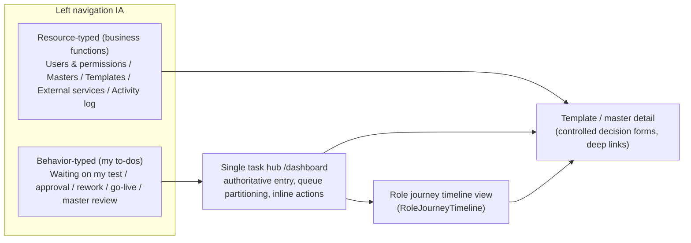

# P21 — Role-Journey Frontend Redesign & Business-Friendly Terminology (Detailed Plan)

**Phase status:** In Progress (activated 2026-06-29; **P21-T01 Done** 2026-06-29 — A0 behavior nav + L1 copy round 1; **P21-T01a Done** 2026-06-29 — task hub deepening; **P21-T02 Done** 2026-06-29 — backend collaboration closed loop; next slice **P21-T01b Not Started** — RoleJourneyTimeline) | **Depends on:** P13, P14, P19, P20 (management shell, dashboard task hub, collaboration work items, i18n registry)
**Confirmed (user, 2 rounds, 2026-06-29):** Hybrid architecture (B) + 4 role clusters by workflow timeline + primary persona = foreign-bank front/middle-office non-IT staff with business-friendly terminology.

> Single-active-phase invariant: **P21 is the active formal phase** (activated 2026-06-29 by
> `plan-orchestrator` selection; no other phase is In Progress). Within P21, run sub-phases in order A → B → C → D, and
> within each sub-phase land the **backend collaboration-work-item contract** before the
> behavior-driven IA, otherwise behavior queues are empty shells.

## 1. Why (problem statement)

Verified by read-only exploration (frontend + workflow contract + plan layer):

- The single `/dashboard` task hub is a **read-only table + jump**: no queue partitioning, no
  inline actions, and it drops mapped fields `triggerType / summaryText / ageSeconds`.
- Left navigation is **resource-typed** (users / masters / templates / policies / audit) with
  **no behavior-typed entries** ("waiting on my test / approval / publish / rework"), decoupled
  from each role's behavior timeline.
- `frontend/src/views/home/RoleHomeView.vue` is orphaned dead code; `routeKeys.ts` /
  `auth/roles.ts` retain workbench logical keys after the views were deleted.
- Backend `CollaborationWorkItemWriter` **emits only `SUBMIT_FOR_TEST` and never writes
  `RESOLVED`** — behavior queues other than TEST are effectively empty.
- **IT-heavy labels** (e.g. "API policy", "credential", "lifecycle", "publish gate", "semver",
  "anchor") raise the learning cost for non-IT bank business users.

## 2. Primary persona & business-friendly terminology (cross-cutting)

### 2.1 Primary persona

| Dimension | Definition |
| --- | --- |
| Identity | Foreign-bank front/middle-office business & operations staff (template orchestration, compliance approval, channel/product operations, team leads) |
| IT literacy | Low–medium; comfortable with Word / email / approval flows; **not** with API / policy / lifecycle / anchor / semver |
| Work context | "I need to finish reviewing this letter template and put it live", "which templates are waiting on my approval", "can this template be called by the channel system" |
| Non-target users | Backend devs, DevOps, API integrators — their technical detail belongs in L2 help / tooltip / contract pages, not in primary navigation or primary button labels |
| Language | English baseline (en-first); zh-CN uses the same business plain-language, not literal IT translation |

Design implications:

- Lead with **what to do**, then **on which object** (action first, object second).
- States use **business stage names**, not enum codes (`DRAFT` → "Drafting", `PENDING_RELEASE`
  → "Awaiting go-live").
- Navigation groups use **business functions**, not technical module names.
- Every behavior entry / journey step / empty / error state explains the next step in one line.

### 2.2 Label governance (three-layer copy model)

- **L1 primary surface** (nav, page titles, buttons, task cards, journey steps): business
  language only; forbidden as primary labels: `policy`, `credential`, `lifecycle`, `gate`,
  `semver`, `anchor`.
- **L2 form fields / table columns**: business name + optional `(?)` help explaining the
  technical meaning.
- **L3 contract / audit / developer views**: precise terms (API Policy, Render Profile) allowed
  (GLOBAL/GROUP or read-only contract pages only).

Phrasing rules: nav = noun phrase; tasks = verb + object; buttons = verb-first; disabled/waiting
states = reason + who is waiting.

Relationship to the i18n constitution: change **only user-visible message values**, **never**
stable keys (`nav.items.apiPolicies` etc.), API paths, or audit field names. English baseline
finalized first; zh-CN aligns to business semantics.

Acceptance (per sub-phase):

- Random 10 L1 labels: a non-IT person can state the meaning within 5 seconds (E2E copy
  assertions + UIUX checklist).
- Primary-journey grep audit: no `policy` / `credential` (as noun menu) / `lifecycle` / `semver`
  / `gate` / `anchor integrity` on L1 surfaces (contract/audit pages excepted).

### 2.3 High-priority terminology mapping (initial draft — landed in A0)

| Current IT label (en) | Business label (en) | Business label (zh-CN) | Note |
| --- | --- | --- | --- |
| API policy / API policies | **API management** | **API 管理** | mental model is "manage integration & calls", not a "policy object" |
| API policy management | Manage API access | API 接入管理 | shorter page title |
| API access (nav group) | **External services** | **对外服务** | emphasize outward business capability |
| API credentials | **Access keys** / Connection accounts | **接入账号** | avoid "credential" |
| Access & identity | **Users & permissions** | **用户与权限** | "entitlement" too IT |
| Master documents | **Letterhead templates** / Document masters | **母版文档** | bank-natural |
| Template authoring | **Template design** | **模板设计** | authoring/orchestrate too IT |
| Lifecycle (tab/panel) | **Approval progress** / Workflow status | **流转进度** | "lifecycle" key only, not label |
| Content modules | **Standard clauses** | **标准条款** | compliance/product familiar |
| Audit log / Audit console | **Activity log** / Audit trail | **操作记录** | "console" too IT |
| Publish gate / blocking impacts | **Pre-release checks** / Issues to fix before go-live | **上线前检查** | "gate" internal only |
| Semver / version bump | **Release version number** | **发布版本号** | hide semver concept |
| Anchor catalog / anchor integrity | **Layout placeholders** / Placeholder check | **版式占位符** | "anchor" help text only |
| Collaboration timeout config | **Reminder timing** | **催办时限设置** | timeout/config too ops |
| Escalation | **Overdue reminder** | **超时提醒** | notification, not system escalation |
| Render profile / fidelity | **Output format check** | **输出效果检查** | expandable L2 help |
| Orchestrate | **Configure** / Set up | **配置** | |
| Callable / runtime callers | **Available to channel systems** | **可供渠道系统调用** | |
| Identity administration | **User management** | **用户管理** | |
| Governance overview | **My overview** | **工作概览** | "governance" too abstract |

Full table is maintained at the companion doc (see §8) and cross-referenced with
`frontend/src/i18n/locales/en.ts` / `zh-CN.ts`.

## 3. Architecture direction (Hybrid B)

Three coexisting layers, all driven by backend `capabilities` + `visibleRoutes` + collaboration
queues; no-permission controls are hidden (not disabled).

Principles:

- **Behavior entry = filtered view of the task hub** (pre-filtered by queue), not a new
  standalone workbench page — compatible with **ADR Batch B / COR-T11**.
- **One guided role journey per role**: a reusable `RoleJourneyTimeline` stepper shows current
  position, available actions, and waiting items.
- **Task hub deepening**: queue partitioning (TEST / APPROVAL / REMEDIATION / PENDING_RELEASE /
  ESCALATION / master review), task cards restore `triggerType/summaryText/ageSeconds`, SLA
  aging + overdue badges, inline open actions (open/jump to decision panel; no in-list
  pass/reject, keeping controlled decisions).
- Decision forms remain **controlled governance forms** (reason category, impact scope, evidence
  confirmation), not rich text.
- **Publish/orchestration separation**: an orchestrator reaching `PENDING_RELEASE` sees
  "awaiting admin go-live", with no publish primary button (unless GROUP/GLOBAL).
- Honor `.cursor/skills/frontend-oa-design/SKILL.md` (REDBC/GREENBC dual brand) and i18n
  english-first. All new/changed user-visible copy passes the §2.3 business review first.

## 4. Role clusters ↔ underlying 7 roles

- Cluster ① Design / orchestration / test: `MASTER_DESIGNER` + `TEMPLATE_AUTHOR` +
  `TEMPLATE_TESTER`
- Cluster ② Approval / team lead: `TEMPLATE_APPROVER` + `GROUP_ADMIN` (API management, publish,
  collaboration governance, exception intervention)
- Cluster ③ Global admin: `GLOBAL_ADMIN`
- Cluster ④ Audit: `AUDIT_ADMIN`

Delivery order follows the workflow timeline, upstream first: ① → ② → ③ → ④.

## 5. Cross-phase backend contract prerequisites

Behavior IA depends on real work items. Each sub-phase lands its queue slice first:

- `backend/.../collaboration/...CollaborationWorkItemWriter`: implement all 6 trigger types
  (currently only `SUBMIT_FOR_TEST`): `TEST_FAILURE_OR_RETURN_TO_DRAFT`, `SUBMIT_FOR_APPROVAL`,
  `APPROVAL_FAILURE_OR_RETURN_TO_DRAFT`, `APPROVAL_PENDING_RELEASE`, `TIMEOUT_ESCALATION`.
- Decision/publish actions write work item `RESOLVED` (no production write today).
- `submitForTest` allows resubmission from "test passed" (contract allows; today only `DRAFT`).
- Each backend slice: behavior-spec → backend-engineer TDD → `mvn verify` green.

## 6. Tasks

Status vocabulary: `Not Started` | `In Progress` | `Blocked` | `Done`. All rows start
`Not Started`. Behavior specs are required before implementation for behavior-changing rows.

### Sub-phase A — Cluster ① + shared foundation (upstream first)

| ID | Task | Key files | Behavior spec | Status |
| --- | --- | --- | --- | --- |
| P21-T01 | A0 foundation + terminology baseline: behavior-typed "My to-dos" nav group (capability/queue-driven, business copy); rewrite L1 copy for nav/dashboard/tasks/breadcrumb | `navStructure.ts`, `ManagementShell.vue`, `en.ts`, `zh-CN.ts` | Required (§12.2 implemented) | Done (2026-06-29) |
| P21-T01a | Task hub deepening: queue partitioning + restore `triggerType/summaryText/ageSeconds` + SLA/overdue badges + inline open actions | `DashboardView.vue`, `useWorkflowTasks.ts`, `utils/collaborationWorkItems.ts`, `stores/collaboration.ts`, `TaskHubPartitionSection.vue` | Required (§12.3) | Done (2026-06-29) |
| P21-T01b | New `RoleJourneyTimeline` reusable stepper (business-language steps, empty/guidance states) | `frontend/src/components/**` (new) | Required | Not Started |
| P21-T01c | Dead-code cleanup: remove `RoleHomeView.vue` (+test); remove residual workbench logical keys | `views/home/RoleHomeView.vue`, `routeKeys.ts`, `auth/roles.ts` | n/a (refactor) | Not Started |
| P21-T01d | Companion terminology guide created (SSOT) + en/zh value sweep round 1 | `docs/product/business-terminology-guide.md`, `en.ts`, `zh-CN.ts` | n/a (doc) | Not Started |
| P21-T02 | A1 backend: emit `TEST_FAILURE → REMEDIATION`; write `RESOLVED` on test decision; allow resubmit-for-test from "test passed" | `backend/.../collaboration/**`, `TemplateLifecycleService`, `ApprovalSubStateResolver` (new) | Required (§12.1 ready) | Done (2026-06-29) |
| P21-T03 | A2 Master designer journey: upload → layout placeholders → submit review → rework timeline + "master review / master to fix" behavior entries (business titles) | `TemplateDetailView.vue` split, masters views, `RoleJourneyTimeline` | Required | Not Started |
| P21-T04 | A3 Orchestrator journey: create → design content → trial generate → submit test → submit approval; "waiting on my fixes" entry; PENDING_RELEASE shows "awaiting team-lead go-live" | template views, lifecycle panel | Required | Not Started |
| P21-T05 | A4 Tester journey: "waiting on my test" entry + guided test-confirm form (business field labels) + read-only evidence review (batch results / coverage / preview / output check) | lifecycle panel, decision form components | Required | Not Started |
| P21-T06 | OPT-G3: split `TemplateDetailView.vue`; business-renamed tabs (releaseVersions → "Published versions", lifecycle → "Workflow status", apiAccess → "External access") | `TemplateDetailView.vue`, `templateDetailTabs.ts` | n/a (refactor) | Not Started |
| P21-T06a | Template-detail interaction bug fixes (AUD-B01/B02): fix `?focus=/?tab=` two-way sync lockup (clear `focus` after deep-link); add `watch(templateId)` to reload on route reuse (stale-data); resolve default-tab vs `TEMPLATE_DETAIL_TABS[0]` vs DOM order split | `TemplateDetailView.vue`, `templateDetailTabs.ts` | Required (regression) | Not Started |
| P21-T06b | Template-detail state completeness (AUD-B06/B07): publish-gate/policy/lifecycle loading-error-empty states (no silent catch); render `bindingGateResult`; long-name/AD-group truncation + semver picker responsive layout | `TemplateDetailView.vue`, `components/templates/**` | Required | Not Started |

### Sub-phase B — Cluster ② Approval + team lead / API management

| ID | Task | Key files | Behavior spec | Status |
| --- | --- | --- | --- | --- |
| P21-T07 | B0 backend: emit `SUBMIT_FOR_APPROVAL`, `APPROVAL_FAILURE → REMEDIATION`, `APPROVAL_PENDING_RELEASE`, `TIMEOUT_ESCALATION`; write `RESOLVED` on approval/publish decisions | `backend/.../collaboration/**`, `TemplateLifecycleService`, escalation scheduler | Required | Not Started |
| P21-T08 | B1 Approver journey: "waiting on my approval" entry + controlled approval decision + `approvalSubState` (PENDING_SUBMIT vs PENDING_DECISION) dual-substate UI | lifecycle panel, decision forms | Required | Not Started |
| P21-T09 | B2 Team-lead / API management journey: master review tasks; "waiting to confirm go-live" entry + pre-release checks + go-live summary confirm | lifecycle panel, dashboard | Required | Not Started |
| P21-T09a | API management / access-keys journey: full L1 copy replacement of API policy/credential surfaces | `ApiPolicyDetailView`, api policy components, `en.ts`, `zh-CN.ts` | Required | Not Started |
| P21-T09b | Reminder timing config + overdue-reminder queue visibility + exception handling ("confirm on behalf" + audit trail copy, not "exception intervention") | `CollaborationTimeoutConfigPanel`, dashboard | Required | Not Started |

### Sub-phase C — Cluster ③ Global admin

| ID | Task | Key files | Behavior spec | Status |
| --- | --- | --- | --- | --- |
| P21-T10 | Bank-wide overview, users & groups management, template deletion, bank-wide reminder defaults, bank-wide overdue monitoring, global to-do view; reuse/extend cluster ② components; copy avoids governance/platform jargon | entitlement views, dashboard | Required | Not Started |

### Sub-phase D — Cluster ④ Audit

| ID | Task | Key files | Behavior spec | Status |
| --- | --- | --- | --- | --- |
| P21-T11 | Activity-log-first landing, query/export journey, read-only "view only, cannot act" model, business-named columns (who / did what / on which template / when); verify new actions (go-live / approval / confirm-on-behalf / overdue) are audit-readable | audit views, `en.ts`, `zh-CN.ts` | Required | Not Started |

### Cross-cutting

| ID | Task | Key files | Status |
| --- | --- | --- | --- |
| P21-X01 | Business terminology system upheld across all sub-phases: audit + rewrite nav/tasks/journey/detail/forms/error fallback copy (en baseline + zh-CN); IT terms only in API/code/audit fields | `en.ts`, `zh-CN.ts`, `messages_en.properties` | Not Started |
| P21-X02 | Governance & docs: register P21, update permission-matrix + catalog-navigation-ux, add ADR extending Batch B, maintain terminology guide; per sub-phase BDD → TDD → E2E + UIUX → doc-sync → commit-review | docs/** | In Progress (registration + companion docs done 2026-06-29; per-slice sync pending) |
| P21-X03 | **Permission single-source & fail-closed remediation** (AUD-P01..P05): unify route guard to one `canAccessRoute` reading only `visibleRoutes`; remove role fallbacks in `resolveCapability` that widen permissions (master/export/author); make missing-capability fail-closed; fix `roles.test.ts` assertions | `auth/roles.ts`, `router/index.ts`, `stores/session.ts`, `composables/useCapabilities.ts` | Required | Not Started |
| P21-X04 | **Backend capability + route + contract completeness** (AUD-P02/P05/P09, AUD-C05): register `route.content-module-management` in `RouteVisibilityService` + `ManagementRoute` + matrix §13.1; expose `exportTemplates` / `viewCollaborationWorkItems` / `maintainCollaborationTimeoutConfig` / content-module capabilities in `ManagementCapabilitiesView`; add `GET /collaboration-work-items` to OpenAPI v1 | `backend/.../authorization/**`, `backend/.../collaboration/**`, `docs/api/openapi-v1.yaml`, `permission-matrix.md` | Required | Not Started |
| P21-X05 | **UI quality & a11y fixes** (AUD-Q01..Q03): define/alias `--color-primary` (table focus ring); add `:focus-visible` to nav items + breadcrumb links; replace bare hex/px with design tokens; brand wordmark shows bank display name not `REDBC/GREENBC` | `AppDataTable.vue`, `ManagementShell.vue`, `AppBreadcrumb.vue`, `BrandLogo.vue`, `theme/tokens.ts`, `styles/global.scss` | n/a (UI) | Not Started |
| P21-X06 | **i18n parity hardening** (AUD-Q04): fill zh-CN gaps (whole `contentModules`, `templates.lifecycle/governance/authoring/rules/create/error`, `paste`); add layered locale key-parity test to block silent en-fallback | `zh-CN.ts`, `i18n/localeRegistry.test.ts` | n/a (i18n) | Not Started |

## 7. Exit criteria (phase)

- Behavior-typed IA entries present and backed by real work items for all 6 trigger types;
  task hub partitioned with inline open actions and restored fields.
- Work items are **closed (`RESOLVED`)** on decision/publish so completed to-dos leave the hub
  (AUD-A01); no "only grows, never shrinks" task list.
- One guided `RoleJourneyTimeline` per role cluster, business-language steps.
- Publish/orchestration separation honored; controlled decision forms retained.
- L1 surfaces free of IT jargon (grep audit passes); non-IT readability spot-check passes.
- **Permission single-source**: route/control visibility derives from backend `visibleRoutes` +
  `capabilities`; missing capability fails closed (AUD-P01..P05 resolved).
- **i18n parity**: zh-CN covers primary journeys; key-parity test green (no silent en-fallback).
- **a11y**: visible focus ring on tables/nav/breadcrumb (`--color-primary` defined); a11y smoke green.
- Single task hub remains the authoritative entry (no standalone workbench pages) — ADR Batch B
  / COR-T11 not violated.
- Green gates: backend `mvn -B -ntp -f backend/pom.xml verify`; frontend
  `pnpm -C frontend lint && type-check && test && build`; Docker 4173 role-journey E2E +
  UIUX dual-brand evidence per user-facing sub-phase.
- Companion docs updated; ledger evidence recorded; exactly one phase In Progress while active.

## 8. Companion documents

Created at registration (2026-06-29):

- `docs/product/business-terminology-guide.md` — terminology SSOT. **Created.**
- `docs/adr/decisions/2026-06-29-behavior-typed-ia-business-terminology.md` — extends (not
  supersedes) Batch B. **Created (Accepted).**
- `docs/product/catalog-navigation-ux.md` — hybrid IA + business-terminology navigation contract
  section. **Updated.**
- `docs/security/permission-matrix.md` §13.1.2 — behavior-typed entry visibility per role.
  **Updated.**

Produced/extended during P21 execution:

- `docs/api/openapi-v1.yaml` — add `GET /collaboration-work-items` (AUD-C05, task P21-X04).
- `docs/security/permission-matrix.md` §13.1/§13.2 — reconcile capability/route drift
  (AUD-P06/M6/M7, task P21-X04).

## 9. Key files (reference)

- Navigation/routing/permissions: `frontend/src/navigation/navStructure.ts`,
  `frontend/src/routing/routeKeys.ts`, `frontend/src/auth/roles.ts`,
  `frontend/src/composables/useCapabilities.ts`
- Task hub/work items: `frontend/src/views/dashboard/DashboardView.vue`,
  `frontend/src/composables/useWorkflowTasks.ts`,
  `frontend/src/utils/collaborationWorkItems.ts`, `frontend/src/stores/collaboration.ts`
- Template detail: `frontend/src/views/templates/TemplateDetailView.vue`,
  `frontend/src/views/templates/templateDetailTabs.ts`,
  `frontend/src/components/templates/TemplateWorkflowBanner.vue`
- Dead code: `frontend/src/views/home/RoleHomeView.vue`
- Backend collaboration: `backend/src/main/java/com/bank/docgen/collaboration/`
  (writer/service/persistence/web)
- i18n: `frontend/src/i18n/locales/en.ts`, `frontend/src/i18n/locales/zh-CN.ts`
  (L1 copy fully business-ized; keys stay stable)

## 10. Source plan

Confirmed working plan: `.cursor/plans/角色行为时序前端重设计_bf33ee8c.plan.md` (user-confirmed
across two rounds, 2026-06-29).

## 11. Audit findings & remediation backlog (code-grounded, 2026-06-29)

Read-only audit across four lenses (permission gating, task hub × collaboration, template
detail × lifecycle, terminology/UI quality). Each finding cites `file:line` evidence and maps to
the owning P21 task. Severity: 🔴 critical / 🟡 medium / 🟢 minor.

### 11.1 Cross-cutting contradictions (root cause)

| ID | Sev | Finding | Evidence | Owner task |
| --- | --- | --- | --- | --- |
| AUD-A01 | 🔴 | Backend never writes `RESOLVED` → completed to-dos never leave the task hub; `pendingActions` inflated; list API only queries `OPEN` | `CollaborationWorkItemWriter.java:32-82`; `TemplateLifecycleService.java:88-135`; `CollaborationWorkItemRepository.java:39-44` | **TEST path Resolved → P21-T02** (2026-06-29); APPROVAL/PUBLISH `RESOLVED` → P21-T07 |
| AUD-A02 | 🔴 | Writer emits only `SUBMIT_FOR_TEST` → 5/6 behavior queues empty in production (APPROVAL/REMEDIATION/PENDING_RELEASE never created; ESCALATION only via scheduler) | `CollaborationWorkItemWriter.java:33-43`; `TemplateLifecycleService.java:84,88-134`; `CollaborationWorkItemTriggerType.java:3-9` | **REMEDIATION emitted → P21-T02** (2026-06-29, partial); APPROVAL/PENDING_RELEASE → P21-T07 |
| AUD-P01 | 🔴 | `manageMasters` role fallback wrongly grants `TEMPLATE_AUTHOR`; unit test asserts the wrong behavior | `auth/roles.ts:36-44,56-57`; `roles.test.ts:79`; backend `GroupAccessService.java:28-30` | P21-X03 |
| AUD-P02 | 🔴 | Content-module route bypasses backend `visibleRoutes` (not in `RouteVisibilityService`/`ManagementRoute`/matrix); `session.canAccessRoute` returns false while router admits | `auth/roles.ts:241-253`; `router/index.ts:95-104,145-149`; `RouteVisibilityService.java:30-70` | P21-X03, P21-X04 |
| AUD-P03 | 🔴 | Dual route-guard APIs (`canAccessLogicalRoute` vs `session.canAccessRoute`) can disagree for the same routeKey | `router/index.ts:145-149`; `stores/session.ts:30-32`; `auth/roles.ts:292-310` | P21-X03 |
| AUD-P04 | 🔴 | `resolveCapability` role fallback widens permissions when capabilities missing (not fail-closed) | `auth/roles.ts:22-34,48-202` | P21-X03 |
| AUD-P05 | 🔴 | `canExportTemplates` bypasses session capabilities (pure roles); backend never exposes `exportTemplates` | `auth/roles.ts:115-125`; `ManagementCapabilitiesView.java:3-15` | P21-X03, P21-X04 |
| AUD-P06 | 🟡 | Permission-matrix §13.1/§13.2 vs code drift (workbench redirect target, content-module route, missing capability rows) | `permission-matrix.md:402-426,457-468`; `ManagementCapabilitiesView.java:3-15` | P21-X04 |

### 11.2 Task hub × collaboration

| ID | Sev | Finding | Evidence | Owner task |
| --- | --- | --- | --- | --- |
| AUD-H01 | 🟡 | Mapped fields `summaryText/ageSeconds/triggerType/queue/submitter` dropped — table renders 4 columns; i18n column keys dangling | `DashboardView.vue:209-264`; `collaborationWorkItems.ts:34-52`; `en.ts:317-324` | **Resolved → P21-T01a Done** (2026-06-29) |
| AUD-H02 | 🟡 | Single mixed table, no queue partitioning | `useWorkflowTasks.ts:59-87`; `DashboardView.vue:184-271` | **Resolved → P21-T01a Done** (2026-06-29) |
| AUD-H03 | 🟡 | Legacy workbench redirects carry no `?queue=`; `fetchWorkItems()` called with no args → behavior entries unfiltered | `router/index.ts:106-114`; `DashboardView.vue:101` | **Resolved → P21-T01a Done** (2026-06-29) — `fetchWorkItems({ queue })` wired |
| AUD-H04 | 🟡 | Sorting conflict: master items lack `createdAt` (sink); table re-sorts by name, overriding newest-first | `useWorkflowTasks.ts:46-52,92-115`; `DashboardView.vue:204` | **Resolved → P21-T01a Done** (2026-06-29) |
| AUD-H05 | 🟡 | Same template can appear twice (TEST + ESCALATION); escalation maps to `template-test` kind | `CollaborationEscalationService.java:69-90`; `collaborationWorkItems.ts:9-15` | **Resolved → P21-T01a Done** (2026-06-29) — `template-escalation` kind |
| AUD-H06 | 🟡 | Coarse load/error: any fetch failure hides all sections; `workItemsErrorMessageKey` unconsumed | `DashboardView.vue:81-107`; `stores/collaboration.ts:20-25` | **Resolved → P21-T01a Done** (2026-06-29) |
| AUD-H07 | 🟢 | collaboration store thin (list only; no queue param applied, no claim/resolve, client-side paging only) | `stores/collaboration.ts:10-42`; `CollaborationWorkItemService.java:58-60` | **Resolved → P21-T01a Done** (2026-06-29) — queue param applied |
| AUD-C05 | 🟢 | OpenAPI missing `GET /collaboration-work-items` (frontend already calls it) | `api/collaboration.ts:17-24`; `openapi-v1.yaml:1416+` | P21-X04 |

### 11.3 Template detail × lifecycle

| ID | Sev | Finding | Evidence | Owner task |
| --- | --- | --- | --- | --- |
| AUD-B01 | 🔴 | `?focus=lifecycle` overrides `?tab=` and is never cleared → locked on lifecycle tab | `TemplateDetailView.vue:102-107,309-327` | P21-T06a |
| AUD-B02 | 🔴 | No `watch(templateId)` → component reuse shows stale template | `TemplateDetailView.vue:305-307,112` | P21-T06a |
| AUD-B03 | 🔴 | APPROVAL dual-substate not surfaced: Badge has no substate; Banner ignores `approvalSubState`; list filter on `APPROVAL` but `TemplateSummary` lacks `approvalSubState` | `TemplateStatusBadge.vue:12-31`; `TemplateWorkflowBanner.vue:31-35`; `TemplateListView.vue:53-58`; `types/template.ts:15-26` | P21-T08 |
| AUD-B04 | 🔴 | `showMetadataEdit` uses `authorTemplates` but matrix limits metadata edit to GLOBAL/GROUP (fail-open UI) | `TemplateDetailView.vue:186-192`; `permission-matrix.md` | P21-X03 |
| AUD-B05 | 🔴 | `test-fail` decision has no remediation fields (only `approval-reject` does) | `TemplateLifecycleDecisionDialog.vue:276-331`; `domain-model.md` §4.1 | P21-T05 |
| AUD-B06 | 🟡 | Publish-gate parallel load failure silent-caught → publish disabled with no reason; `bindingGateResult` fetched but never rendered | `TemplateDetailView.vue:329-365,89,904-927` | P21-T06b |
| AUD-B07 | 🟡 | Policy/lifecycle panels lack error/empty states; long name/AD-group no truncation; semver picker responsive break | `TemplateDetailView.vue:1056-1082,755-758,929-936` | P21-T06b |
| AUD-B08 | 🟡 | Default-tab model split: `TEMPLATE_DETAIL_TABS[0]='overview'` vs fallback `releaseVersions` vs DOM order | `templateDetailTabs.ts:1,9`; `TemplateDetailView.vue:800-807` | P21-T06a |
| AUD-B09 | 🟡 | Banner and Detail each maintain a separate capability×status matrix (drift risk) | `TemplateWorkflowBanner.vue:23-49`; `TemplateDetailView.vue:144-181` | P21-T06 |
| AUD-B10 | 🟡 | Submit-for-approval has no evidence checklist gate; exception UI only GROUP (not GLOBAL) | `TemplateDetailView.vue:848-854`; `TemplateLifecycleDecisionDialog.vue:333-361` | P21-T09 |

### 11.4 Terminology / UI quality / dead code

| ID | Sev | Finding | Evidence | Owner task |
| --- | --- | --- | --- | --- |
| AUD-Q04 | 🔴 | zh-CN primary-journey keys missing at scale (whole `contentModules`; `templates.lifecycle/governance/authoring/...`) → silent English fallback | `zh-CN.ts` (no `contentModules`); `zh-CN.ts:854-899` vs `en.ts:687-771` | P21-X06 |
| AUD-Q05 | 🟡 | High IT-jargon density on L1 — **T01 resolved in-scope keys** (nav groups/items, dashboard/task-hub L1, collaboration queue labels, breadcrumb routes per §12.2 Spec B); **remaining out-of-scope surfaces** (API policy pages, template-detail tabs, audit page bodies, `templates.*` / `apiPolicy.*` / `audit.*` L1) → **P21-X01** | `en.ts` — in-scope keys rewritten 2026-06-29; residual IT terms at `templates.*`, `apiPolicy.*`, `audit.*` | **P21-T01 Done** (in-scope L1); remainder → P21-X01 |
| AUD-Q01 | 🔴 | `--color-primary` undefined → table keyboard focus ring invisible | `AppDataTable.vue:72-74,90-92` | P21-X05 |
| AUD-Q02 | 🟡 | No `:focus-visible` on nav items / breadcrumb links | `ManagementShell.vue:252-278`; `AppBreadcrumb.vue:44-51` | P21-X05 |
| AUD-Q03 | 🟡 | Brand wordmark shows internal code `REDBC/GREENBC`; bare hex/px and unregistered CSS vars | `BrandLogo.vue:31`; `en.ts:127-128`; `TemplateDetailView.vue:1325` | P21-X05 |
| AUD-D01 | 🟡 | Dead code: `RoleHomeView.vue` orphaned (only its own test); duplicates Dashboard stats/summary/quicklinks | `RoleHomeView.vue`; `RoleHomeView.test.ts:6` | P21-T01c |
| AUD-D02 | 🟡 | Workbench dead logic: routeKeys + `canAccess*Workbench` + `canAccessLogicalRoute` branches + `workbench.*` i18n; test asserts unreachable branch | `routeKeys.ts:11-13`; `auth/roles.ts:275-305`; `roles.test.ts:141-158`; `en.ts:293+` | P21-T01c |
| AUD-D03 | 🟢 | `template-author-draft` task kind has no producer; `home.*Governance*` copy referenced only by dead code | `useWorkflowTasks.ts:16-23`; `en.ts:146-165,256-258` | P21-T01c |
| AUD-M02 | 🟢 | Role constants split: `MANAGEMENT_ROLES` only 4; TESTER/APPROVER/MASTER_DESIGNER as bare strings | `auth/roles.ts:3-8`; `types/identity.ts:1-9` | P21-X03 |

### 11.5 Remediation order (audit-driven)

1. **P0 backend** — AUD-A01/A02: emit all triggers + write `RESOLVED` (P21-T02 then P21-T07).
   **P21-T02 Done (2026-06-29):** TEST path closed loop — `recordTestDecision` resolves OPEN TEST
   to-dos (`RESOLVED`+`resolvedAt`); FAILED→DRAFT upserts one OPEN REMEDIATION
   (`TEST_FAILURE_OR_RETURN_TO_DRAFT`, dedup/idempotent); `submitForTest` accepts DRAFT or
   APPROVAL+PENDING_SUBMIT (PENDING_DECISION fail-closed); dedicated create/resolve audit;
   `ApprovalSubStateResolver` extracted as `approvalSubState` SSOT. **Remaining → P21-T07:**
   APPROVAL/PUBLISH `RESOLVED` + `SUBMIT_FOR_APPROVAL`/`APPROVAL_FAILURE`/`APPROVAL_PENDING_RELEASE`.
2. **P0 security** — AUD-P01..P05: permission single-source + fail-closed (P21-X03).
3. **P0 bugs** — AUD-B01/B02: focus/tab lockup + stale templateId (P21-T06a).
4. **P0 i18n/a11y** — AUD-Q04 zh-CN parity, AUD-Q01 focus ring (P21-X06, P21-X05).
5. **P1** — task hub depth (AUD-H01..H06, P21-T01a); APPROVAL dual-substate (AUD-B03, P21-T08);
   L1 terminology — **AUD-Q05 in-scope L1 → P21-T01 Done** (2026-06-29); full-system sweep → P21-X01;
   matrix/capability drift (AUD-P06, P21-X04).
6. **P2** — decision/governance forms (AUD-B05/B10); detail state completeness (AUD-B06/B07);
   OpenAPI contract (AUD-C05).
7. **P3** — dead code + component split + role constants (AUD-D01..D03, AUD-M02, AUD-B09).

## 12. Behavior specifications (BDD)

Executable behavior specs for behavior-changing P21 slices. Each spec is the source for the
TDD Red tests and must stay traceable to the owning source-of-truth documents. Specs are added
per slice as the slice enters its behavior-spec stage.

### 12.1 P21-T02 — Backend collaboration work-item closed loop (A1)

**BDD readiness:** `ready` (core behavior confirmed in source-of-truth docs; design defaults
below flagged for confirmation are non-blocking).

**Traceability:**

- Domain — `docs/domain/domain-model.md` §2.9.4 (Template Collaboration Work Item): trigger types
  include 提交测试 / 测试不通过或回到草稿; 退回草稿生成提交人或模板编排人员整改待办;
  协作待办创建、解决、超时升级必须记录审计; 待办按模板所属组和角色队列分配,展示仅非敏感摘要.
- Permission — `docs/security/permission-matrix.md` §5 (提交测试: 仅草稿状态或测试通过状态可提交测试;
  测试通过 → 测试通过状态; 测试不通过 → 回到草稿), §10 (审计范围: 协作待办创建、解决), §13.1.2
  (行为型入口: TEST / REMEDIATION 队列可见性; 前置依赖: 后端补齐 6 种触发的发射与 `RESOLVED` 关闭).
- Plan — this doc §5 (cross-phase backend contract prerequisites), §6 P21-T02 row, §11.1 AUD-A01/AUD-A02.
- Code under change — `TemplateLifecycleService.recordTestDecision` / `submitForTest`,
  `collaboration/service/CollaborationWorkItemWriter`, `CollaborationWorkItemRepository`.

**Lifecycle model context (current code):** `DRAFT → submitForTest → TESTING`;
`TESTING → recordTestDecision(PASSED) → APPROVAL` (with `approvalSubState=PENDING_SUBMIT`, the
business "test passed / awaiting submit-for-approval" state); `TESTING → recordTestDecision(FAILED) → DRAFT`;
`APPROVAL(PENDING_SUBMIT) → submitForApproval → APPROVAL(PENDING_DECISION)`. There is **no** distinct
`TEST_PASSED` enum; "测试通过" = `APPROVAL` + `PENDING_SUBMIT`.

#### Spec A — Resolve TEST work item on test decision

- **Actor / role:** TEMPLATE_TESTER (normal) or GLOBAL/GROUP admin (exception intervention), within
  the template's owning group scope.
- **Goal:** Record a test pass/fail decision and have the corresponding open TEST to-do leave the hub.
- **Trigger:** `recordTestDecision(PASSED|FAILED)` on a template in `TESTING`.
- **Preconditions:** Template in `TESTING`; an OPEN `TEST` work item exists for the template
  (created by `submitForTest`); caller passes `requireTestableTemplate` authorization (role +
  group scope; admin exception requires reason + secondary confirm + separate audit marker per §5).
- **Primary journey:** authz → validate decision form → transition status → resolve OPEN `TEST`
  work item(s) for the template (`status=RESOLVED`, `resolvedAt=now`, `updatedAt=now`) → return detail.
- **System responses (success):** TEST decision transition recorded (PASSED→APPROVAL, FAILED→DRAFT);
  the open TEST work item is closed so `GET /collaboration-work-items?queue=TEST` no longer returns it.

#### Spec B — Emit REMEDIATION on test failure (FAILED → DRAFT)

- **Actor / role:** same as Spec A; the produced to-do targets the orchestration queue.
- **Goal:** When a test is rejected, surface a "Waiting on my fixes" to-do to the orchestrator.
- **Trigger:** `recordTestDecision(FAILED)`.
- **Preconditions:** as Spec A; template returns to `DRAFT`.
- **Primary journey:** Spec A resolution + upsert one OPEN `REMEDIATION` work item
  (`triggerType=TEST_FAILURE_OR_RETURN_TO_DRAFT`, `queue=REMEDIATION`, `groupCode=template group`,
  non-sensitive `summaryText` via message key, `submitterUserId`=carried-forward orchestrator).
- **System responses (success):** REMEDIATION to-do visible to TEMPLATE_AUTHOR (REMEDIATION queue)
  and admins within the owning group; invisible to other groups/roles.

#### Spec C — Allow resubmit-for-test from "test passed"

- **Actor / role:** TEMPLATE_AUTHOR / MASTER_DESIGNER / GLOBAL / GROUP (writable-template authz).
- **Goal:** Re-run testing after a template already passed test but before submit-for-approval.
- **Trigger:** `submitForTest` on a template in `APPROVAL` with `approvalSubState=PENDING_SUBMIT`.
- **Preconditions:** `requireWritableTemplate` passes; status is `DRAFT` **or** (`APPROVAL` and
  `PENDING_SUBMIT`). Status `APPROVAL` + `PENDING_DECISION` (already submitted for approval) is **not** eligible.
- **Primary journey:** authz → status guard accepts DRAFT or APPROVAL/PENDING_SUBMIT → transition to
  `TESTING` → upsert OPEN `TEST` work item (`SUBMIT_FOR_TEST`).
- **System responses (success):** status `TESTING`; a fresh OPEN TEST to-do present; any prior
  RESOLVED TEST to-do remains resolved.

#### Acceptance scenarios (Given / When / Then)

- **(Test passed resolves TEST to-do)** Given a template in `TESTING` with one OPEN `TEST` work item,
  When a tester records `PASSED`, Then the status becomes `APPROVAL` (`PENDING_SUBMIT`) **and** that
  TEST work item becomes `RESOLVED` with `resolvedAt` set, and the TEST queue no longer returns it.
- **(Test failed resolves TEST + creates REMEDIATION)** Given a template in `TESTING` with one OPEN
  `TEST` work item, When a tester records `FAILED`, Then the status returns to `DRAFT`, the TEST work
  item becomes `RESOLVED` (`resolvedAt` set), **and** exactly one OPEN `REMEDIATION` work item exists
  with `triggerType=TEST_FAILURE_OR_RETURN_TO_DRAFT`, `queue=REMEDIATION`, and the template's `groupCode`.
- **(REMEDIATION dedup / idempotent)** Given an OPEN `REMEDIATION` work item already exists for the
  template, When another `FAILED` decision occurs on a later test cycle, Then the existing OPEN
  REMEDIATION is refreshed (not duplicated) — at most one OPEN REMEDIATION per template.
- **(Resubmit from test passed)** Given a template in `APPROVAL` with `approvalSubState=PENDING_SUBMIT`,
  When an author calls `submitForTest`, Then the status becomes `TESTING` and an OPEN `TEST` work item exists.
- **(Resubmit blocked once in approval decision)** Given a template in `APPROVAL` with
  `approvalSubState=PENDING_DECISION`, When `submitForTest` is attempted, Then it is rejected
  (invalid state / fail-closed), status unchanged, no new TEST work item created.
- **(Group isolation)** Given a tester/author authorized only for group A, When they act on a template
  owned by group B, Then the action is denied (fail-closed) and no work-item state changes; a created
  REMEDIATION is only visible within the template's owning group.
- **(Audit trail)** Given any of the above decisions, When the work item is resolved or a REMEDIATION
  is created, Then an audit summary is recorded for the work-item resolution and creation (per domain
  §2.9.4 / §10), carrying only non-sensitive summary fields (no variable values, customer data, full
  generated content, or plaintext).

#### Boundary & exception behavior

- **No open TEST work item at decision time:** resolution is a no-op (idempotent); the decision still
  succeeds (defensive against data drift).
- **Multiple OPEN TEST work items (drift):** resolve all OPEN TEST work items for the template.
- **Unauthorized actor / out-of-scope group:** fail-closed; unified safe error; no work-item writes;
  no leakage of out-of-scope template/work-item existence.
- **Admin exception test decision:** still requires reason + secondary confirmation + separate audit
  marker (§5); the resolve/emit behavior is identical.
- **Resubmit from any non-eligible status** (`TESTING`, `PENDING_RELEASE`, `PUBLISHED`, `STOPPED`,
  `DEPRECATED`, or `APPROVAL`+`PENDING_DECISION`): rejected, status unchanged.

#### Observable evidence

- Work-item rows: `status` transitions OPEN→RESOLVED with `resolvedAt`; new REMEDIATION row with the
  expected `queue` / `triggerType` / `groupCode`.
- API: `GET /collaboration-work-items?queue=TEST|REMEDIATION` reflects closed TEST and new REMEDIATION
  scoped to the owning group and the viewer's visible queues.
- Lifecycle: `TemplateDetailView.lifecycleStatus` / `approvalSubState` reflect transitions.
- Audit: collaboration work-item resolve + create audit summaries (non-sensitive) present.

#### Decided defaults (confirm if different — non-blocking)

1. **Audit granularity:** add dedicated collaboration work-item create + resolve audit summaries
   (domain §2.9.4 + §10 mandate auditing 创建/解决). Alternative would be to rely solely on the
   lifecycle decision audit; chosen default honors the domain mandate.
2. **Resubmit eligibility:** `APPROVAL` is resubmit-eligible **only** when `approvalSubState=PENDING_SUBMIT`
   ("测试通过"); `PENDING_DECISION` ("待审批") is not. Matches permission-matrix §5 "测试通过状态".
3. **REMEDIATION uniqueness:** at most one OPEN REMEDIATION per template (upsert/refresh), mirroring the
   existing `SUBMIT_FOR_TEST` upsert pattern.
4. **REMEDIATION `submitterUserId`:** carry forward the orchestrator who submitted for test (so the
   "Waiting on my fixes" to-do points back to the owner), not the tester who rejected.

### 12.2 P21-T01 — A0 foundation + terminology baseline (behavior nav + L1 copy round 1)

**Implementation status:** **Done** (2026-06-29). Behavior-typed `myTodos` nav group + six
capability/queue-driven entries; deep-link URL contract (`?queue=` / `?filter=master-review`
+ `#tasks-section`); L1 value rewrites per Spec B (keys stable); nav active-state for filtered
dashboard landing. **Gate evidence:** frontend lint/type-check/test/build green (**267+** Vitest);
Playwright `P21-T01-behavior-nav.spec.ts` **7/7**, `P21-T01-uiux-evidence.spec.ts` **1/1**,
`a11y-smoke` + `collaboration-todos` **9/9** (dev :5173 + backend :8080); UIUX manifest
`frontend/e2e/evidence/P21-T01-uiux-manifest.md` — **PASS** (0 🔴).

**BDD readiness:** `ready` (confirmed in source-of-truth docs; no blocking pending questions).

**Scope boundary (this slice only):**

- **In:** behavior-typed **My to-dos / 我的待办** nav group; capability/queue-driven entry visibility;
  deep-link URL contract to `/dashboard`; L1 value rewrites for nav groups/items, dashboard
  page title/description/breadcrumb, and task-hub visible copy (section titles, stat cards, task
  row titles/descriptions, collaboration queue L1 labels used on dashboard surfaces).
- **Out (later slices):** queue partitioning / table columns / inline open actions (**P21-T01a**);
  `RoleJourneyTimeline` (**P21-T01b**); dead-code removal (**P21-T01c**); API-policy / template-detail /
  audit-console full L1 sweeps (**P21-T09a**, **P21-T11**, **P21-X01**); permission single-source
  remediation (**P21-X03**); zh-CN parity hardening (**P21-X06**).

**Traceability:**

- Plan — this doc §2 (terminology / three-layer copy), §3 (Hybrid B IA), §6 P21-T01 row, §11 AUD-Q05.
- Terminology SSOT — `docs/product/business-terminology-guide.md` §3–§4.1, §4.3.
- Permission — `docs/security/permission-matrix.md` §13.1.2 (behavior-typed entry visibility).
- Navigation contract — `docs/product/catalog-navigation-ux.md` (Hybrid IA section).
- ADR — `docs/adr/decisions/2026-06-29-behavior-typed-ia-business-terminology.md` (P21-D01, P21-D05).
- Code under change — `frontend/src/navigation/navStructure.ts`, `ManagementShell.vue` (nav
  active-state + navigate), `frontend/src/auth/roles.ts` (visibility helpers), `frontend/src/i18n/locales/en.ts`,
  `zh-CN.ts`; dashboard shell copy only (`DashboardView.vue` title/breadcrumb bindings, not table
  partition logic).

#### Spec A — Behavior-typed "My to-dos" navigation group

- **Actor / role:** any authenticated management user; visible behavior entries vary by session
  `roles` + `capabilities` (role fallback only when capability boolean absent — current seam until
  **P21-X03**).
- **Goal:** Find work by "what is waiting on me" from the left nav without opening a separate
  workbench page.
- **Trigger:** user opens the management shell after login; left nav renders.
- **Preconditions:** authenticated session with `visibleRoutes` including `route.dashboard-home`
  (dashboard remains reachable for all roles that today receive it); Hybrid B / COR-T11 preserved
  (no standalone workbench routes reintroduced).
- **Primary journey:** shell loads → `buildVisibleNavGroups` returns resource-typed groups
  (unchanged group **ids** and item **ids** / **routeKeys** / **paths**) plus a new behavior group
  → each behavior item deep-links to `/dashboard` with a fixed query contract → user lands on the
  single authoritative task hub.
- **System responses (success):** a nav group labeled **My to-dos** (en) / **我的待办** (zh-CN)
  appears **after** the existing `overview` group and **before** resource groups when at least one
  behavior entry is visible; each visible entry is a button with a business-friendly label; clicking
  navigates to `/dashboard?…` (see URL contract below); entries without permission are **omitted**
  (not disabled, not `aria-disabled` placeholders).

**Behavior group definition (stable ids / keys — new keys allowed for new surfaces):**

| Stable id | Group label key | en value | zh-CN value |
| --- | --- | --- | --- |
| `myTodos` | `nav.groups.myTodos` | My to-dos | 我的待办 |

**Behavior entry catalog (visibility + deep link):**

| Stable item id | Label key | en value | zh-CN value | Visibility rule | Deep link |
| --- | --- | --- | --- | --- | --- |
| `behavior-testing` | `nav.behaviorItems.testing` | Waiting on my testing | 待我测试 | `decideTests` capability **or** role ∈ {GLOBAL_ADMIN, GROUP_ADMIN, TEMPLATE_TESTER} | `/dashboard?queue=TEST#tasks-section` |
| `behavior-approval` | `nav.behaviorItems.approval` | Waiting on my approval | 待我审批 | `decideApprovals` **or** role ∈ {GLOBAL_ADMIN, GROUP_ADMIN, TEMPLATE_APPROVER} | `/dashboard?queue=APPROVAL#tasks-section` |
| `behavior-remediation` | `nav.behaviorItems.remediation` | Waiting on my fixes | 待我修改 | `authorTemplates` **or** role ∈ {GLOBAL_ADMIN, GROUP_ADMIN, TEMPLATE_AUTHOR} | `/dashboard?queue=REMEDIATION#tasks-section` |
| `behavior-pending-release` | `nav.behaviorItems.pendingRelease` | Waiting to confirm go-live | 待确认上线 | `publishTemplates` **or** role ∈ {GLOBAL_ADMIN, GROUP_ADMIN} | `/dashboard?queue=PENDING_RELEASE#tasks-section` |
| `behavior-escalation` | `nav.behaviorItems.escalation` | Overdue to follow up | 超时待跟进 | role ∈ {GLOBAL_ADMIN, GROUP_ADMIN} **and** (`viewCollaborationWorkItems` when exposed, else implicit admin) | `/dashboard?queue=ESCALATION#tasks-section` |
| `behavior-master-review` | `nav.behaviorItems.masterReview` | Masters to review | 待审核母版 | `reviewMasters` **or** role ∈ {GLOBAL_ADMIN, GROUP_ADMIN}; **also** `MASTER_DESIGNER` when session can access master management (own rework queue — item filtering is **P21-T01a**, entry visibility follows matrix §13.1.2) | `/dashboard?filter=master-review#tasks-section` |

**URL contract (fixed for T01a compatibility):**

- **`queue`** — optional query param; values **must** match backend/API enum
  `CollaborationWorkItemQueue`: `TEST` | `APPROVAL` | `REMEDIATION` | `PENDING_RELEASE` |
  `ESCALATION`. T01a will pass this to `fetchWorkItems({ queue })` and client-side partition logic.
- **`filter`** — optional query param for non-collaboration workflow slices; T01 defines
  `filter=master-review` for master-review tasks derived from masters catalog (not a collaboration
  queue). Only one of `{queue, filter}` is set by behavior nav links.
- **`#tasks-section`** — hash scroll target (existing dashboard anchor); T01 must preserve scroll-on-load
  when hash present (extend current `#tasks-section` behavior to run on query+hash navigation, not
  only `route.hash` changes from empty).
- **Unfiltered hub:** existing overview item remains `/dashboard` (no `queue` / `filter`) — authoritative
  entry per ADR Batch B / P21-D01.

**Nav active state:** when `route.path === '/dashboard'` and `route.query.queue === '<VALUE>'`, the
matching behavior item is `active`; when path is `/dashboard` with no `queue`/`filter`, the overview
`dashboard` item is `active`. Resource-typed items keep path-prefix active logic unchanged.

#### Spec B — Resource-typed navigation unchanged structurally (L1 label values only)

- **Actor / role:** same session as Spec A.
- **Goal:** Resource catalog remains package-first; only user-visible labels become business-friendly.
- **Trigger:** nav renders.
- **Preconditions:** `NAV_GROUPS` resource groups keep the same `id`, item `id`, `routeKey`, and
  `path` values as today (`overview`, `entitlement`, `documentContent`, `api`, `security`).
- **Primary journey:** visibility still driven by `visibleRoutes` (+ existing content-module seam);
  only i18n **values** bound to existing keys change per SSOT table below.
- **System responses (success):** no new resource routes; no workbench route keys; grep audit passes
  on changed L1 values.

**Round-1 L1 value rewrites (keys stable — values only):**

| Stable key | Current en (IT) | New en (business) | New zh-CN (business) |
| --- | --- | --- | --- |
| `nav.groups.entitlement` | Access & identity | Users & permissions | 用户与权限 |
| `nav.groups.apiAccess` | API access | External services | 对外服务 |
| `nav.groups.security` | Security & audit | Security & activity | 安全与操作记录 |
| `nav.items.masters` | Master documents | Letterhead templates | 母版文档 |
| `nav.items.contentModules` | Content modules | Standard clauses | 标准条款 |
| `nav.items.apiPolicies` | API policies | API management | API 管理 |
| `nav.items.audit` | Audit log | Activity log | 操作记录 |
| `nav.routes.identityAdministration` | Identity & groups | User management | 用户管理 |
| `nav.routes.audit` | Audit console | Activity log | 操作记录 |
| `nav.routes.apiPolicy` | API policy | API management | API 管理 |
| `nav.routes.masters` | Master documents | Letterhead templates | 母版文档 |
| `nav.routes.templateAuthoring` | Template authoring | Template design | 模板设计 |
| `home.dashboard.title` | Governance overview | My overview | 工作概览 |
| `dashboard.title` | My tasks | My tasks | 我的任务 |
| `dashboard.description` | (contains "lifecycle") | Workflow to-dos for in-flight letter templates, plus a snapshot of your letterheads and templates. | 进行中的信函模板待办，以及母版与模板目录快照。 |
| `dashboard.stats.sectionTitle` | Catalog & workflow snapshot | Catalog & workflow snapshot | 目录与工作流快照 |
| `dashboard.stats.sectionDescription` | (contains "lifecycle") | Package counts list registered letterheads and templates; workflow counts reflect in-flight review or approval steps. | 目录数量统计已登记的母版与模板；工作流数量反映进行中的审核或审批步骤。 |
| `dashboard.stats.pendingActions.title` | Actions assigned to you | To-dos assigned to you | 分配给我的待办 |
| `dashboard.stats.pendingActions.description` | (contains "publish" as primary actor verb for all) | Open items waiting for your test, approval, go-live confirmation, or review decision. | 等待您完成测试、审批、确认上线或审核的待办事项。 |
| `dashboard.tasks.title` | Pending actions | My to-dos | 我的待办 |
| `dashboard.tasks.description` | Complete these items in the linked master or template detail pages. | Open each item from its letterhead or template detail page to complete the next step. | 请从对应的母版或模板详情页打开并完成下一步。 |
| `dashboard.tasks.masterReview.title` | Review master document | Review letterhead template | 审核母版文档 |
| `dashboard.tasks.templateTest.title` | Complete test decision | Record test result | 记录测试结果 |
| `dashboard.tasks.templateApproval.title` | Complete approval decision | Record approval decision | 记录审批结果 |
| `dashboard.tasks.templatePublish.title` | Publish template | Confirm go-live | 确认上线 |
| `dashboard.tasks.templateDraft.title` | Continue template authoring | Continue template design | 继续模板设计 |
| `collaboration.workItem.queue.*.label` | Testing / Approval / Remediation / Pending release / Escalation | In testing / Awaiting approval / Needs fixes / Awaiting go-live / Overdue follow-up | 测试中 / 待审批 / 待修改 / 待上线 / 超时待跟进 |
| `collaboration.workItem.queue.*.title` | (IT verbs) | Align to behavior entry phrasing (verb + object) per terminology guide §4.3 | 与 §4.3 行为型入口语义对齐 |
| `collaboration.workItems.empty` | collaboration to-do | to-do | 待办 |
| `collaboration.timeoutConfig.title` | Collaboration timeout thresholds | Reminder timing | 催办时限设置 |

Keys **not** rewritten in T01 (explicitly deferred): `dashboard.tasks.columns.*` (T01a),
`templates.*`, `apiPolicy.*`, `audit.*` page bodies, `workbench.*` (dead until T01c), contract/L3
surfaces.

#### Spec C — Role × visible behavior entries (matrix alignment)

Cross-check with `permission-matrix.md` §13.1.2:

| Role | Visible behavior entries |
| --- | --- |
| GLOBAL_ADMIN | all six |
| GROUP_ADMIN | all six |
| TEMPLATE_TESTER | testing only |
| TEMPLATE_APPROVER | approval only |
| TEMPLATE_AUTHOR | remediation only |
| MASTER_DESIGNER | master review only (plus resource nav per existing routes; no TEST/APPROVAL/REMEDIATION/PENDING_RELEASE/ESCALATION unless capabilities also grant — should not) |
| AUDIT_ADMIN | **none** (behavior group hidden entirely) |

Admins with multiple capabilities see the union of entries. Empty behavior group → **omit entire
group** (do not render "My to-dos" heading with zero items).

#### Acceptance scenarios (Given / When / Then)

**Behavior nav visibility**

- **(Tester sees testing entry)** Given a session with role `TEMPLATE_TESTER` and `decideTests: true`,
  When the management shell renders, Then nav includes group `myTodos` with exactly
  `behavior-testing`, and excludes approval/remediation/pending-release/escalation/master-review entries.
- **(Approver sees approval entry)** Given role `TEMPLATE_APPROVER` and `decideApprovals: true`, When
  the shell renders, Then only `behavior-approval` appears under `myTodos`.
- **(Author sees remediation entry)** Given role `TEMPLATE_AUTHOR` and `authorTemplates: true`, When
  the shell renders, Then only `behavior-remediation` appears under `myTodos`.
- **(Group admin sees admin queues)** Given role `GROUP_ADMIN` with admin capabilities, When the shell
  renders, Then `myTodos` includes testing, approval, remediation, pending-release, escalation, and
  master-review entries (six items).
- **(Audit admin — no behavior group)** Given role `AUDIT_ADMIN` only (no collaboration roles), When
  the shell renders, Then no `myTodos` group is present and no behavior items render as disabled stubs.
- **(No permission — hidden not disabled)** Given role `TEMPLATE_TESTER`, When rendering nav, Then
  `behavior-approval` DOM node is absent (not a disabled button).

**Deep links**

- **(Testing deep link)** Given a visible `behavior-testing` entry, When the user activates it, Then
  router navigates to `{ path: '/dashboard', query: { queue: 'TEST' }, hash: '#tasks-section' }`.
- **(Master review deep link)** Given a visible `behavior-master-review` entry, When activated, Then
  navigation targets `/dashboard?filter=master-review#tasks-section`.
- **(Overview hub unchanged)** Given the overview `dashboard` item, When activated, Then navigation
  targets `/dashboard` with no `queue` or `filter` query params.
- **(Single task hub — no new route)** Given any behavior entry click, Then no navigation to
  `/tester-workbench`, `/approver-workbench`, or `/escalation-workbench` occurs (COR-T11).

**L1 terminology / i18n**

- **(Keys stable)** Given the T01 diff, When reviewing i18n changes, Then no stable keys under
  `nav.*`, `dashboard.*`, `home.dashboard.*`, `collaboration.workItem.queue.*` are renamed or removed;
  only string values change (plus **new** keys allowed: `nav.groups.myTodos`, `nav.behaviorItems.*`).
- **(en baseline grep audit — in-scope keys)** Given built en locale for keys listed in Spec B, When
  grepping primary-journey nav + dashboard task surfaces in scope, Then no matches for forbidden L1
  nouns: `\bpolicy\b`, `\bcredential`, `\blifecycle\b`, `\bsemver\b`, `\bgate\b`, `\banchor integrity\b`,
  `\bgovernance overview\b`, `\baudit console\b` (case-insensitive word boundaries on user-visible
  values only).
- **(zh-CN semantic alignment)** Given zh-CN values for the same keys, When compared to en baseline,
  Then wording conveys business intent (e.g. 对外服务 not API 访问; 操作记录 not 审计控制台 on nav L1).

**Resource nav regression**

- **(Structure unchanged)** Given any session, When comparing `NAV_GROUPS` resource entries pre/post
  T01, Then group ids and item ids/routeKeys/paths are identical; only label values differ.
- **(Capability-driven resource visibility unchanged)** Given `visibleRoutes` without
  `route.api-policy-management`, When a tester session renders nav, Then API management item remains
  hidden exactly as before T01.

#### Boundary & exception behavior

- **Missing `route.dashboard-home` in `visibleRoutes`:** behavior entries are hidden (fail-closed); no
  orphan behavior links.
- **Capability absent, role present:** use existing `resolveCapability` role fallback in
  `auth/roles.ts` (documented seam; **P21-X03** will tighten fail-closed).
- **Capability explicitly `false`:** entry hidden even if role fallback would grant (capability wins).
- **Empty queue at runtime (backend not yet emitting — pre-T07):** nav entry still visible when
  permitted; dashboard may show empty state (T01a improves empty copy/partition). T01 must **not**
  hide behavior entries solely because queue count is zero.
- **Direct URL `/dashboard?queue=APPROVAL` without permission:** route guard allows dashboard if
  `route.dashboard-home` visible; queue param does not grant extra actions (display-only pre-T01a;
  fail-closed actions remain on detail pages). T01a may add client-side ignore of unauthorized queue
  filters — out of T01 unless trivial.
- **Unknown `queue` query value:** dashboard loads unfiltered or ignores invalid param without
  console errors (defensive; T01a may formalize).
- **Locale switch:** behavior labels re-render from i18n keys; deep-link query contract unchanged.

#### Observable evidence

- **Unit tests:** `navStructure.test.ts` — per-role visible behavior item ids; group omitted when
  empty; deep-link paths include correct `queue`/`filter` + hash; resource group structure regression.
- **Component tests:** `ManagementShell.test.ts` — behavior group renders for tester/admin; absent for
  audit admin; click emits router navigation with query contract.
- **i18n tests:** snapshot or explicit assertions on rewritten values; key-parity unchanged except
  new `nav.groups.myTodos` + `nav.behaviorItems.*` keys added to **both** en and zh-CN.
- **Grep gate (CI-friendly script or test):** scan in-scope en values for forbidden L1 tokens listed
  in Spec B acceptance.
- **Manual / E2E (smoke, optional in T01):** login as tester → left nav shows "Waiting on my testing"
  → lands on `/dashboard?queue=TEST#tasks-section` with business copy on page title area.

#### Decided defaults (non-blocking)

1. **Behavior group placement:** immediately after `overview`, before `entitlement` — matches
   "action first" persona journey without displacing the unfiltered hub.
2. **Query param names:** `queue` for collaboration queues (matches OpenAPI/list API); `filter` for
   master-review client slice — T01a owns consuming both.
3. **Scroll target:** retain `#tasks-section` hash on all behavior deep links (AUD-H03 remediation
   path).
4. **New i18n keys:** `nav.groups.myTodos` + six `nav.behaviorItems.*` keys are **new stable keys**
   (allowed); all other changes are value-only on existing keys.
5. **MASTER_DESIGNER master-review visibility:** show entry when user can access master management;
   orchestration-only designers without pending review still see the entry (empty state acceptable until
   T01a).
6. **Dashboard dynamic title on filtered landing:** optional in T01; if not implemented, static
   `dashboard.title` ("My tasks") suffices — queue-specific `<h1>` enhancement deferred to T01a.

#### Out of scope reminders for implementer

- Do **not** implement queue partitioning, restored `triggerType/summaryText/ageSeconds` columns, or
  `fetchWorkItems({ queue })` wiring in T01 (**P21-T01a**).
- Do **not** remove `RoleHomeView` / workbench keys (**P21-T01c**).
- Do **not** change backend capabilities exposure (**P21-X04**) in T01.

### 12.3 P21-T01a — Task hub deepening (queue partition + fields + SLA badges + open actions)

**BDD readiness:** `ready` (confirmed against domain §2.9.4, permission matrix §13.1.2, T01 URL
contract §12.2, and audit findings AUD-H01..H07; no blocking pending questions).

**Implementation status:** **Done** (2026-06-29) — `TaskHubPartitionSection.vue`, queue partitions,
`fetchWorkItems({ queue })`, restored columns, overdue badges, Open actions, segmented errors;
AUD-H01..H07 closed. Gates: Vitest **280+**; Playwright T01a **6/6** + UIUX manifest **PASS**.

**Scope boundary (this slice only):**

- **In:** consume T01 deep-link URL contract (`?queue=` / `?filter=master-review` + `#tasks-section`);
  dynamic landing `<h1>`; queue-partitioned task sections (non-mixed tables); wire
  `fetchWorkItems({ queue })`; restore collaboration table fields (`triggerType`, `summaryText`,
  `ageSeconds`, submitter display); SLA aging display + overdue badges; per-row inline **Open** action
  (navigate to template lifecycle panel or master detail); remediate AUD-H02..H06 (+ H01 field drop,
  H03/H07 store/API queue param, H05 escalation kind).
- **Out:** `RoleJourneyTimeline` stepper (**P21-T01b**); dead-code / workbench key removal
  (**P21-T01c**); in-list pass/reject/publish decisions (remain on controlled detail forms); backend
  emit of additional trigger types beyond what P21-T02/T07 already land (**P21-T07** for
  APPROVAL/PENDING_RELEASE); OpenAPI registration (**P21-X04**); permission single-source
  (**P21-X03**); zh-CN parity hardening (**P21-X06**).

**Traceability:**

- Domain — `docs/domain/domain-model.md` §2.9.4: collaboration work items are in-app to-dos by
  template group + role queue; display is non-sensitive summary only; timeout escalation is
  notification-only (no auto decision / no status change); create/resolve/escalation audited.
- Permission — `docs/security/permission-matrix.md` §13.1.2 (queue visibility per role; display does
  not grant extra edit/decide/publish rights); §13.3 fail-closed unauthorized access.
- Plan — this doc §3 (task hub deepening), §6 P21-T01a row, §11.2 AUD-H01..H07, §12.2 URL contract.
- Terminology — `docs/product/business-terminology-guide.md` §4.1/§4.3 (`Escalation` → **Overdue
  reminder** / 超时提醒 on L1; SLA badge copy avoids IT "escalation" as primary label).
- Navigation — `docs/product/catalog-navigation-ux.md` (behavior entries = filtered task-hub views).
- Code under change — `DashboardView.vue`, `useWorkflowTasks.ts`, `utils/collaborationWorkItems.ts`,
  `stores/collaboration.ts`, `api/collaboration.ts` (params only), i18n `dashboard.tasks.*` /
  `collaboration.workItems.*` column/action keys.

#### Spec A — URL-driven landing title and queue scope

- **Actor / role:** any authenticated user with `route.dashboard-home` visible; effective queue/filter
  scope further constrained by role capabilities (§13.1.2).
- **Goal:** Land from a behavior nav deep link (or bookmark) and immediately see the correct queue
  context in page title and task section(s).
- **Trigger:** navigation to `/dashboard` with optional query params per §12.2 URL contract.
- **Preconditions:** T01 behavior nav + `#tasks-section` scroll contract already shipped; session
  authenticated.
- **Primary journey:** route resolves → dashboard reads `route.query.queue` and/or
  `route.query.filter` → sets page `<h1>` and task-hub scope → scrolls to `#tasks-section` when hash
  present (extend existing watcher on `queue`/`filter`/`hash`).
- **System responses (success):**

| Route query | Page `<h1>` i18n key (en exemplar) | Task-hub scope |
| --- | --- | --- |
| _(none)_ | `dashboard.title` — "My tasks" | **Unfiltered hub:** all visible queue partitions + master sections (Spec B) |
| `queue=TEST` | `collaboration.workItem.queue.TEST.title` — "Waiting on my testing" | Single TEST partition only |
| `queue=APPROVAL` | `collaboration.workItem.queue.APPROVAL.title` | Single APPROVAL partition only |
| `queue=REMEDIATION` | `collaboration.workItem.queue.REMEDIATION.title` | Single REMEDIATION partition only |
| `queue=PENDING_RELEASE` | `collaboration.workItem.queue.PENDING_RELEASE.title` | Single PENDING_RELEASE partition only |
| `queue=ESCALATION` | `collaboration.workItem.queue.ESCALATION.title` — "Overdue to follow up" | Single ESCALATION partition only |
| `filter=master-review` | `nav.behaviorItems.masterReview` — "Masters to review" | Master review (+ rework when `manageMasters`, Spec B) only — no collaboration partitions |

- **Mutual exclusion:** when `filter=master-review` is set, `queue` is ignored for scope (T01 nav
  never sets both). Description paragraph under `<h1>` may use queue-specific copy when filtered; when
  unfiltered, retain `dashboard.description`.

#### Spec B — Queue-partitioned sections (non-mixed tables)

- **Actor / role:** same as Spec A.
- **Goal:** Scan work by queue/stage without a single mixed table (AUD-H02).
- **Trigger:** task hub renders after data load.
- **Preconditions:** catalog fetch (masters/templates) and collaboration fetch complete or failed
  independently (Spec F).
- **Primary journey (unfiltered hub):** for each collaboration queue the viewer may see (per
  `CollaborationWorkItemAccessSupport` / matrix §13.1.2), render a **dedicated section** with:
  - section heading = `collaboration.workItem.queue.<QUEUE>.label` (business stage chip text);
  - its own `AppDataTable` (or equivalent) containing **only** items for that queue;
  - section-level empty state when the partition has zero rows (`collaboration.workItems.empty` or
    queue-specific empty key if added);
  - sections with zero rows **and** no visibility may be omitted; sections the role may view but
    that are empty show empty state (do not hide solely because count is zero — T01 §12.2 default).
  Master-derived tasks render in separate section(s):
  - **Letterhead review** (`master-review` kind) when `reviewMasters`;
  - **Letterhead rework** (`master-rework` kind) when `manageMasters` (includes MASTER_DESIGNER
    rework per matrix §13.1.2 note).
- **Primary journey (filtered by `queue`):** render **one** collaboration section for that queue
  only; omit other collaboration partitions; master sections hidden unless `filter=master-review`.
- **Primary journey (filtered by `filter=master-review`):** render master review (+ rework when
  applicable) section(s) only; **do not** call `fetchWorkItems` for collaboration queues (or ignore
  collaboration rows in UI).
- **System responses (success):** no mixed collaboration+master table; same template may appear in
  two partitions (e.g. TEST source + ESCALATION follow-up) without deduplication — each row stays in
  its queue section (AUD-H05).

#### Spec C — `fetchWorkItems({ queue })` wiring (AUD-H03, AUD-H07)

- **Actor / role:** user with `canViewCollaborationWorkItems` (role-based today; capability when
  exposed in P21-X04).
- **Goal:** Deep-linked queue views load server-filtered items; unfiltered hub loads all visible
  queues in one call.
- **Trigger:** `DashboardView` mount and on `route.query.queue` change (when collaboration visible).
- **Preconditions:** viewer authorized for requested queue (backend enforces; frontend passes param
  faithfully).
- **Primary journey:**
  - `queue=<VALID>` and viewer has queue visibility →
    `collaborationStore.fetchWorkItems({ queue })` → API `GET /collaboration-work-items?queue=…`.
  - no `queue` param (unfiltered) → `fetchWorkItems()` with **no** queue filter → API returns all
    visible queues for authorized groups.
  - `filter=master-review` → skip collaboration fetch unless stats elsewhere need it (task sections
    do not).
- **System responses (success):** store `workItems` reflects server filter; `loadingWorkItems` drives
  skeleton for collaboration section(s) only; on failure `workItemsErrorMessageKey` set and thrown
  error handled per Spec F (not global dashboard failure).

#### Spec D — Restored row fields and columns (AUD-H01)

- **Actor / role:** collaboration queue viewer.
- **Goal:** See actionable context (what happened, how long waiting, who submitted) without opening
  detail first.
- **Trigger:** collaboration partition renders rows mapped by `collaborationWorkItemToTask`.
- **Preconditions:** API returns `triggerType`, `summaryText`, `ageSeconds`, `submitterUserId`,
  `createdAt` (already on `CollaborationWorkItemSummary`).
- **Primary journey:** table columns (L1 business labels — use/extend existing keys):

| Column | Source field | Display rule |
| --- | --- | --- |
| Action | `titleKey` (queue-driven) | existing |
| Item | `entityName` (`templateName`) | existing |
| Group | `groupCode` | existing |
| Stage / trigger | `triggerType` | i18n `collaboration.workItem.trigger.<TYPE>.description` (L1 business copy) |
| Summary | `summaryText` | API non-sensitive summary verbatim (truncate with ellipsis + title tooltip if long) |
| Waiting | `ageSeconds` | `formatCollaborationAgeSeconds(ageSeconds)` + optional SLA badge (Spec E) |
| Submitter | `submitterUserId` | display as provided (opaque id; no PII expansion in v1) |
| Open | — | inline primary action (Spec G) |

- **System responses (success):** mapped fields no longer dropped between `collaborationWorkItems.ts`
  and `DashboardView`; master partitions retain simpler columns (action, item, group, hint) without
  collaboration-only fields.

#### Spec E — SLA aging and overdue badges

- **Actor / role:** collaboration queue viewer; timeout thresholds readable for badge computation
  (load global default + resolve per-item group thresholds the same way backend escalation does).
- **Goal:** Visually distinguish items approaching/exceeding reminder timing without implying auto
  action (domain §2.9.4 notification-only).
- **Trigger:** row render for collaboration source tasks.
- **Preconditions:** timeout config fetch succeeds or degrades gracefully (badge suppressed on config
  error, age text still shown).
- **Primary journey:** for each collaboration row, compare `ageSeconds` against resolved threshold
  hours for `(item.queue, item.groupCode)`:
  - `ESCALATION` queue rows **always** show overdue badge (`collaboration.workItems.badge.overdue`
    — en **Overdue reminder**, zh-CN **超时提醒**);
  - `TEST` / `APPROVAL` / `REMEDIATION` / `PENDING_RELEASE` rows show overdue badge when
    `ageSeconds >= thresholdHours * 3600`;
  - optionally show neutral age chip without badge when under threshold (no "approaching" badge in
    v1 unless implementer adds `badge.approaching` — **deferred**, non-blocking).
- **System responses (success):** badge is visual only; does not enable extra actions; template
  lifecycle status unchanged from badge display.

#### Spec F — Segmented load / error (AUD-H06)

- **Actor / role:** any dashboard viewer.
- **Goal:** Catalog snapshot or collaboration list failure must not hide unrelated sections.
- **Trigger:** any parallel dashboard fetch fails.
- **Preconditions:** `loadDashboardData` orchestrates masters, templates, collaboration independently.
- **Primary journey:**
  - masters fetch fail → show `LoadErrorPanel` (or inline error) **only** in masters-dependent stats;
    task hub still renders if collaboration/masters-for-tasks succeeded.
  - templates fetch fail → same pattern for template stats.
  - collaboration fetch fail → show `LoadErrorPanel` with `collaborationStore.workItemsErrorMessageKey`
    (fallback `collaboration.workItems.error.load`) **inside** `#tasks-section`; stats cards and
    timeout config panel remain when their data loaded.
  - retry actions scoped per segment (collaboration retry re-invokes `fetchWorkItems` with current
    route queue param).
- **System responses (success):** global `loadError` no longer suppresses entire `#tasks-section` and
  quick links when only one fetch fails; `workItemsErrorMessageKey` consumed.

#### Spec G — Inline open actions (jump to detail)

- **Actor / role:** user who can see the row (visibility ≠ permission to decide).
- **Goal:** Open the correct detail/lifecycle panel in one click from the task hub.
- **Trigger:** user activates row **Open** control or activates row (keyboard Enter retained).
- **Preconditions:** row `path` already computed (`templateLifecyclePanelPath(templateId)` for
  collaboration; `/masters/:id` for master tasks).
- **Primary journey:** **Open** button/link per row (i18n `dashboard.tasks.actions.open` — en
  **Open**, zh-CN **打开**) calls `router.push(path)`; does **not** submit lifecycle decisions.
- **System responses (success):** navigation lands on template detail lifecycle tab or master detail;
  no new permissions granted.

#### Spec H — Sorting and master timestamp (AUD-H04)

- **Actor / role:** any dashboard viewer.
- **Goal:** Newest waiting items surface first; master tasks do not sink to bottom.
- **Trigger:** partition row list computed.
- **Preconditions:** collaboration rows have `createdAt`; master rows gain surrogate `createdAt` from
  `master.updatedAt` when present, else `0`.
- **Primary journey:** each partition sorted **newest-first** by `createdAt` before pagination;
  table `default-sort` must **not** override to `entityName` ascending — align default with
  `createdAt` descending or disable conflicting client re-sort.
- **System responses (success):** master review/rework rows interleave correctly by recency within
  their master section; collaboration sort stable across filtered/unfiltered views.

#### Spec I — Escalation task kind mapping (AUD-H05)

- **Actor / role:** GROUP/GLOBAL admin viewing ESCALATION partition.
- **Goal:** Escalation rows distinct from TEST rows for styling, title, and future journey hooks.
- **Trigger:** `collaborationWorkItemToTask` for `queue=ESCALATION`.
- **Preconditions:** backend emits `TIMEOUT_ESCALATION` trigger (scheduler or test seed).
- **Primary journey:** map `ESCALATION` → new `WorkflowTaskKind` **`template-escalation`** (not
  `template-test`); `titleKey` remains `collaboration.workItem.queue.ESCALATION.title`; path still
  template lifecycle panel for admin follow-up visibility.
- **System responses (success):** same template may appear once under TEST (or other source queue
  in unfiltered view) and once under ESCALATION with distinct kind/badge.

#### Acceptance scenarios (Given / When / Then)

**URL landing title & scope**

- **(TEST deep link title)** Given a tester session, When navigating to
  `/dashboard?queue=TEST#tasks-section`, Then `<h1>` shows "Waiting on my testing" (key
  `collaboration.workItem.queue.TEST.title`) And only the TEST partition renders And
  `fetchWorkItems` was called with `{ queue: 'TEST' }`.
- **(Master review filter)** Given a GROUP_ADMIN session, When navigating to
  `/dashboard?filter=master-review#tasks-section`, Then `<h1>` shows "Masters to review" And only
  master review/rework sections render And no collaboration queue sections render.
- **(Unfiltered hub title)** Given any session on `/dashboard` without query params, Then `<h1>` shows
  "My tasks" (`dashboard.title`) And all visible queue partitions render (Spec B).
- **(Unknown queue ignored)** Given `/dashboard?queue=NOT_A_QUEUE`, When the page loads, Then no
  console error And hub falls back to unfiltered scope (or treats as empty invalid — **default:
  unfiltered hub**) And `<h1>` is `dashboard.title`.
- **(Unauthorized queue — fail-closed display)** Given a TEMPLATE_TESTER session, When navigating
  to `/dashboard?queue=ESCALATION`, Then collaboration section shows access-safe empty or error
  (backend deny or empty list) And no ESCALATION rows from other groups leak.

**Queue partitioning**

- **(Non-mixed tables)** Given a GROUP_ADMIN with OPEN items in TEST and APPROVAL queues, When viewing
  unfiltered `/dashboard`, Then TEST rows appear only under the TEST section heading And APPROVAL rows
  appear only under the APPROVAL section And there is no single table mixing both queues.
- **(Duplicate template across partitions)** Given template X has OPEN TEST and OPEN ESCALATION work
  items, When viewing unfiltered hub, Then template X appears once in TEST section and once in
  ESCALATION section with distinct kinds `template-test` and `template-escalation`.
- **(Filtered single partition)** Given `/dashboard?queue=REMEDIATION`, When data loads, Then only the
  REMEDIATION section is present And rows are exclusively `queue=REMEDIATION`.

**Fields & sorting**

- **(Restored columns visible)** Given a TEST work item with `summaryText`, `ageSeconds=7200`,
  `triggerType=SUBMIT_FOR_TEST`, When the TEST partition renders, Then the row shows summary text,
  formatted age "2h", and trigger description copy And submitter id column is populated.
- **(Newest first within partition)** Given two TEST items with different `createdAt`, When the TEST
  section renders, Then the newer `createdAt` row appears before the older regardless of template name.
- **(Master sort surrogate)** Given two `PENDING_REVIEW` masters with different `updatedAt`, When the
  master-review section renders, Then the more recently updated master appears first.

**SLA / overdue badges**

- **(Overdue badge on aged TEST item)** Given TEST threshold 24h and a TEST item with `ageSeconds >=
  86400`, When the row renders, Then an "Overdue reminder" badge is visible And template status is
  unchanged.
- **(ESCALATION always badged)** Given an ESCALATION queue item regardless of age, When the row
  renders, Then the overdue badge is shown.
- **(Under threshold — age only)** Given TEST item with age below threshold, When rendered, Then age
  text shows without overdue badge.

**Inline open & segmented error**

- **(Open action navigates)** Given a visible collaboration row for template T, When the user clicks
  **Open**, Then router navigates to `/templates/T?tab=lifecycle` (lifecycle panel path).
- **(Collaboration load error isolated)** Given masters/templates loaded successfully but
  `fetchWorkItems` fails, When dashboard renders, Then stat cards remain visible And `#tasks-section`
  shows collaboration load error with retry And the error message key is not swallowed.
- **(Masters fail — tasks persist)** Given collaboration loaded but masters catalog fetch fails, When
  dashboard renders, Then collaboration partitions still render And global page is not entirely
  replaced by a single error panel.

**Regression (T01 contract preserved)**

- **(Hash scroll)** Given any behavior deep link with `#tasks-section`, When navigation completes,
  Then the tasks section scrolls into view.
- **(No workbench routes)** Given inline open from task hub, Then navigation never targets
  `/workbench/*` paths.

#### Boundary & exception behavior

- **Empty queue (backend not yet emitting):** permitted nav entry (T01) still lands on filtered view
  with queue-specific title and section empty state — not 404, not hidden section.
- **Collaboration viewer false:** collaboration sections omitted entirely; master sections still shown
  when capabilities allow; no fetch attempted.
- **Timeout config unavailable:** render age text; suppress overdue badge (no fail-closed deny of task
  list).
- **Pagination:** client-side paging **per partition** (existing `CLIENT_TABLE_PAGE_SIZE`); filters
  apply within partition.
- **Row click vs Open:** both navigate; Open is accessible name for assistive tech; row click retained
  for power users.
- **Legacy workbench redirect:** `/workbench/*` → `/dashboard#tasks-section` still works but does not
  carry `?queue=` (acceptable; user may use behavior nav for filtered view — optional enhancement out
  of scope unless trivial).

#### Observable evidence

- **Unit:** `collaborationWorkItems.test.ts` — `ESCALATION` → `template-escalation` kind;
  `useWorkflowTasks.test.ts` — partition helpers, master `createdAt` surrogate, queue-filtered task
  subsets; new tests for overdue badge helper if extracted.
- **Component:** `DashboardView` / task partition component tests — filtered `<h1>`, section count per
  route query, column headers include summary/age/trigger, segmented error panels.
- **Store:** `collaboration` store test — `fetchWorkItems({ queue: 'TEST' })` passes param to API
  mock.
- **E2E:** extend `P21-T01-behavior-nav.spec.ts` (filtered title + single partition) and
  `collaboration-todos.spec.ts` (restored columns, Open action, overdue badge on seeded escalation);
  new `P21-T01a-task-hub.spec.ts` optional.
- **UIUX:** dual-brand evidence for filtered TEST landing + overdue badge row (follow
  `frontend/e2e/helpers/uiux-evidence.ts` pattern).

#### Decided defaults (non-blocking)

1. **Unfiltered invalid `queue`:** fall back to full hub (not error page).
2. **Section headings:** use `collaboration.workItem.queue.*.label` (stage chip), not IT enum names.
3. **Open action label:** new stable key `dashboard.tasks.actions.open` (+ zh-CN).
4. **Overdue badge key:** new `collaboration.workItems.badge.overdue` (+ zh-CN **超时提醒**).
5. **Master `createdAt` surrogate:** `master.updatedAt` ISO string; missing → sort last.
6. **Threshold source for badges:** reuse `GET /collaboration-timeout-config` global default +
  group override resolution mirroring backend `CollaborationTimeoutResolver` semantics client-side
  (group override when present for item's `groupCode`).
7. **No in-list decisions:** Open only; controlled forms unchanged on detail pages (permission matrix
   §13.1.2).

#### Out of scope reminders for implementer

- Do **not** implement `RoleJourneyTimeline` (**P21-T01b**).
- Do **not** add pass/reject/publish buttons in list rows.
- Do **not** change backend work-item writer/emission (**P21-T07** for remaining triggers).
- Do **not** register OpenAPI or change authorization model (**P21-X03**, **P21-X04**).
